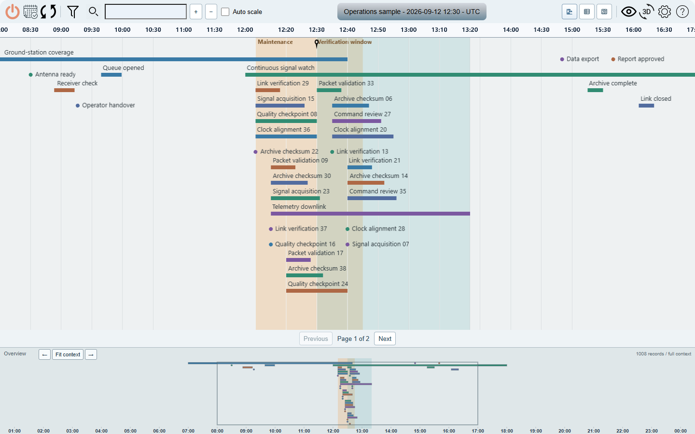
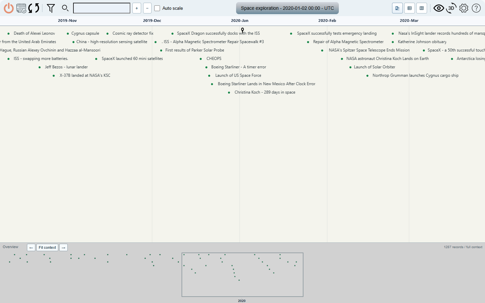

# Overview

**OpenBEXI Timeline** is an interactive timeline and Gantt chart for exploring
events, sessions and activity histories. Use local JSON data on its own, or
connect to a Java server for progressive loading and managed datasets.

- **Explore time:** drag into the past or future, zoom the main view or Overview,
  and keep the visible time window centered in Overview.
- **Find and organize records:** search, highlight matches, apply saved filters,
  and group by namespace, type or other data fields.
- **Choose a view:** switch between Timeline, Table and Split. The layout fills
  the browser and pages through records that do not fit on screen.
- **Read the details:** open metadata, descriptions, activity history and report
  links in a responsive panel. Drag its divider or use the keyboard to resize it.
- **Keep navigating while data loads:** connected views prioritize visible
  records, buffer neighboring intervals, and show loading, retry and coverage states.

## Screenshots

Real application captures using public or synthetic data. Click an image to open
it at full resolution. Both desktop examples use the same display width.

**Operations sample — sessions, events and a centered Overview**

<a href="docs/ui/overview/default-dataset-desktop.png"></a>

**Space exploration — historical events and a wider time context**

<a href="docs/ui/overview/space_exploration-desktop.png"></a>

See the [desktop and narrow-screen gallery](docs/ui/overview/README.md) and
[complete descriptor examples](docs/ui/navigation-details/README.md) for more
captures and reproduction details.

## Quick start

Install **Node.js 24**, then run these commands from the project directory:

```sh
npm ci
npm run demo
```

Open [the demo gallery](http://localhost:8780/demos.html). The demo server runs
locally and the supplied JSON datasets work without a Java data server.

<!-- LIVE_DEMOS:START -->
## Live demos

Start the local server with [Quick start](#quick-start), then choose a demo. Each uses the same Timeline, Table and Split views; its data, bands, colors and time scales come from [the catalog](demos/catalog.json) and model files.

| Demo | What it shows | Resources |
| --- | --- | --- |
| [Operations sample](http://localhost:8780/demos.html?demo=default-dataset) | Sessions, milestones, source colors, and maintenance and verification windows. | [Data](json/test-data/default-dataset.json) · [Model](models/demos/default-dataset.json) · [Screenshot](docs/ui/overview/default-dataset-desktop.png) |
| [Dinosaurs](http://localhost:8780/demos.html?demo=dinausaurs) | Dinosaur lifespans on a numeric axis measured in millions of years ago. | [Data](json/test-data/dinausaurs.json) · [Model](models/demos/dinausaurs.json) · [Screenshot](docs/ui/overview/dinausaurs-desktop.png) |
| [Satellite ephemeris](http://localhost:8780/demos.html?demo=ephemeris) | Orbital visibility sessions grouped by satellite. | [Data](json/test-data/ephemeris.json) · [Model](models/demos/ephemeris.json) · [Screenshot](docs/ui/overview/ephemeris-desktop.png) |
| [JFK chronology](http://localhost:8780/demos.html?demo=jfk) | A minute-scale historical chronology with highlighted reference windows. | [Data](json/test-data/jfk.json) · [Model](models/demos/jfk.json) · [Screenshot](docs/ui/overview/jfk-desktop.png) |
| [Claude Monet](http://localhost:8780/demos.html?demo=monet) | Life events, painting periods, original colors, and a secondary age scale. | [Data](json/test-data/monet.json) · [Model](models/demos/monet.json) · [Screenshot](docs/ui/overview/monet-desktop.png) |
| [Religious history](http://localhost:8780/demos.html?demo=religions) | BCE/CE dates, duration and event bands, and overview context. | [Data](json/test-data/religions.json) · [Model](models/demos/religions.json) · [Screenshot](docs/ui/overview/religions-desktop.png) |
| [Space exploration](http://localhost:8780/demos.html?demo=space_exploration) | A month-scale view with a yearly overview of the supplied space-history events. | [Data](json/test-data/space_exploration.json) · [Model](models/demos/space_exploration.json) · [Screenshot](docs/ui/overview/space_exploration-desktop.png) |

Append `&view=table` or `&view=split` to a demo URL to open that view directly. See the [demo guide](docs/demos.md) for data formats, model options and hosting.
<!-- LIVE_DEMOS:END -->

## Server and REST API

Connected timelines read configured sources and saved filters from the Java
server. Startup logs print the ready-to-open web page URL. Request logs report
status, separate session/event counts, loading coverage and timing.
See [connected setup and diagnostics](docs/connected-diagnostics.md) and
[progressive loading](docs/progressive-loading.md) for configuration and protocol details.

To run the managed-data API locally, install **JDK 17 or later** and **Maven**, then run:

```sh
npm run api
```

Open [the API explorer](http://localhost:8781/docs/api.html). API v1 supports
dataset/model discovery, paginated queries, and authorized editing of managed
records and saved filters. Public catalog examples remain read-only and can be
cloned. See the [API guide](docs/rest-api.md) and [OpenAPI contract](swagger/openapi-v1.json).

## Docker

```sh
docker build -t openbexi-timeline .
docker run --rm -p 127.0.0.1:8442:8442 -v openbexi-data:/data openbexi-timeline
```

Open [the container's demo gallery](http://localhost:8442/demos.html). The container
serves HTTP and uses the named volume for persistent data. Configure a TLS reverse
proxy and API tokens for a deployed service; see [security and deployment](docs/security.md).

## Development and validation

```sh
npm run demos:validate
npm run demos:readme -- --check
npm test
npx playwright install chromium --only-shell
npm run test:browser
mvn --batch-mode --no-transfer-progress verify
```

CI checks the schemas, generated documentation, JavaScript, Java and browser
behavior. The [browser testing guide](docs/browser-tests.md) explains screenshot
baselines. After editing the demo catalog, regenerate its README table with
`npm run demos:readme`.

Use the [demo guide](docs/demos.md) to add datasets and models, and the
[help guide](docs/help-guide.md) for timeline controls. Bug reports should include
reproduction steps and a public or synthetic example. Keep private configuration,
records, logs and screenshots out of shared files; see [privacy guidance](docs/privacy.md).

## Copyright and Licensing

**Current version: [2.0.0](https://github.com/arcazj/openbexi_timeline/releases/tag/v2.0.0)**, OpenBEXI Timeline 2.0.
The [release notes](docs/release-2.0.md) describe the included changes, verified
checks and remaining scope. Create the reviewed source archive and its
SHA-256 manifest in `dist/` with:

```sh
npm run release:source
```

OpenBEXI Timeline retains its existing [GPL license](LICENSE), copyright notices
and [third-party notices](docs/third-party-notices.md).

The proposed free noncommercial / paid commercial offering is documented in the
[commercial licensing proposal](docs/commercial-licensing.md). It remains a draft
for ownership and legal review and does not replace the current license.
