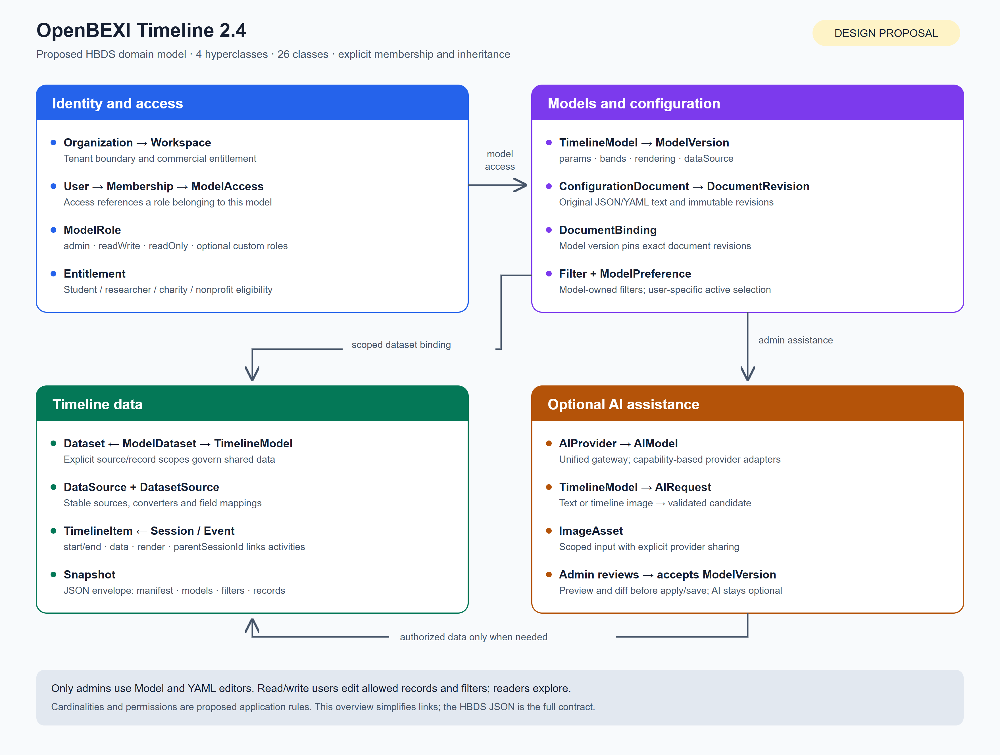

# OpenBEXI Timeline 2.4 design

This is the 2.4 domain and editor design. Start with the
[consolidated implementation prompt](implementation-prompt.md),
[delivery and validation record](delivery-checklist.md) and the overview below.



- [Importable HBDS JSON](timeline-2.4.hbds.json): all classes, typed attributes,
  links, cardinalities, membership, inheritance and example session/event objects.
- [Complete diagram from the HBDS viewer](timeline-2.4.hbds.png): open at full size
  to read attributes and relationship labels.
- [Scalable overview](timeline-2.4.overview.svg).
- [Example YAML model](timeline-model.example.yaml): an existing supported model
  shape, also included as JSON in the HBDS examples.
- Validation: [schemas and semantics](schema-validation.json) and
  [viewer checks](validation-results.json).

The model uses [OpenBEXI HBDS](https://github.com/arcazj/openbexi_hbds)
at commit `51b61998c12597cd435680158f185c81af2fa9ce`, following its
[structural profile](https://github.com/arcazj/openbexi_hbds/blob/51b61998c12597cd435680158f185c81af2fa9ce/doc/HBDS_STRUCTURAL_DIAGRAM_PROFILE_V1.md)
and [v2 semantic schema](https://github.com/arcazj/openbexi_hbds/blob/51b61998c12597cd435680158f185c81af2fa9ce/schemas/hbds-semantic-profile-v2.schema.json).
Open its editor, paste the JSON into JSON Preview, and apply it. A locally served
copy may also load the file through its model manifest.

Four hyperclasses group identity/access, models/configuration, timeline data,
and optional AI assistance. `Session` and `Event` inherit `TimelineItem`.
An activity is a child item linked to a session, preserving both current nested
and flat representations.

Event, session and activity item JSON is a fixed compatibility contract. Keep
field names, types, nesting, null/absent distinctions and unknown metadata intact.
Model ownership, roles, entitlements and AI/HBDS state belong in external stores;
the design does not add `datasetId` or other new fields to existing items.

Cardinalities, field types and permission rules under `extensions.timeline24`
are proposed application constraints. HBDS schema validation does not enforce
commercial eligibility or model authorization. The JSON is a domain design,
not a production database migration or a new application configuration format.
The implemented access, configuration and AI boundaries are described in
[model access](../../model-access.md) and [AI assistance](../../ai-assistance.md).
The domain design also describes future capabilities beyond this implementation;
it does not imply billing, shared dataset aliases or federated login are available.
The [Commercial and Exempt Use License](../../../LICENSE) defines the actual
licensing terms; the design's entitlement fields do not grant a legal license.

To reproduce the artifacts from the timeline repository root, use Node.js 24,
the installed project dependencies, Python 3, Playwright with a supported browser,
and a checkout of the pinned HBDS reference:

```powershell
node docs/design/2.4/build-artifacts.mjs
node docs/design/2.4/validate-artifacts.mjs C:/path/to/openbexi_hbds
node docs/design/2.4/render-artifacts.mjs C:/path/to/openbexi_hbds
```

Rendering uses the actual simulator through a temporary browser route. It does
not start its API server. The default reference checkout location is
`.local-private/hbds-reference`.
