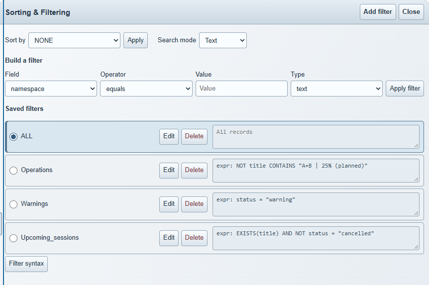

# Compact Sorting & Filtering

Version 2.6.0 places saved filter names, actions and copyable expression previews
in compact metallic rows. Edit unlocks the preview; Save validates and persists
the expression, while Cancel or Escape restores the saved value. Narrow panels
stack the controls and textarea, and high contrast strengthens borders and focus.

The screenshot uses synthetic filter names and expressions in the public demo.
It was captured in Chromium at a 1440 by 900 viewport with the panel expanded.

The browser regression in `tests/browser/filter-panel.spec.mjs` checks desktop
and narrow layouts, copying availability, validation, cancellation, persistence,
deletion, long expressions and focus in high contrast.
