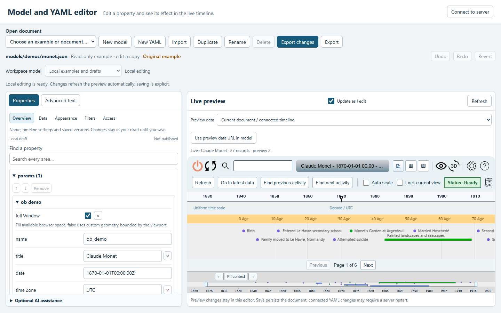
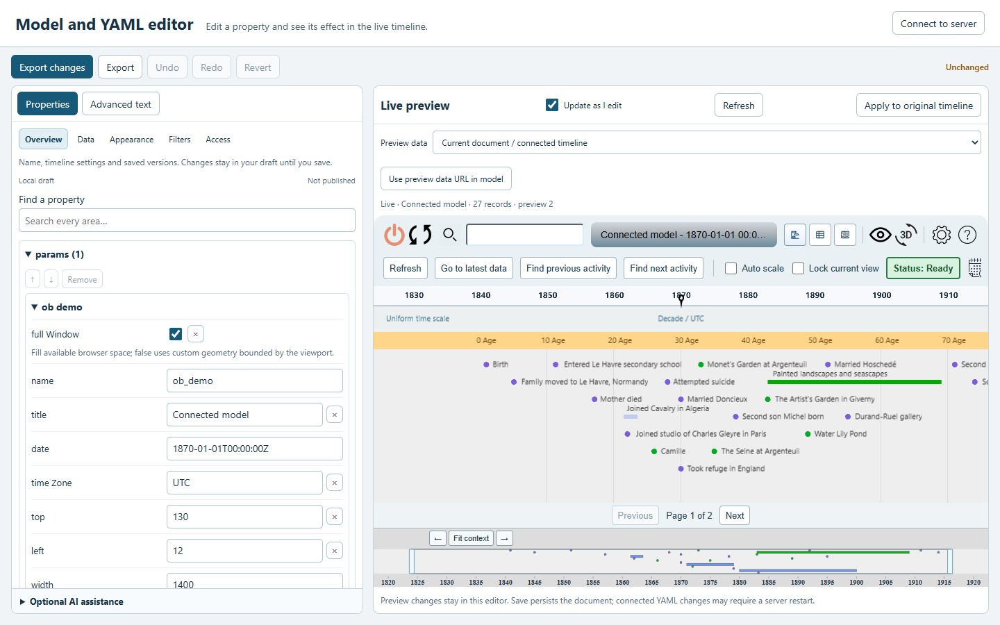

# Model and YAML editor

The public Monet example shows the full document manager, five editor areas and
live preview at [desktop](desktop.png), [narrow](narrow.png) and [phone](phone.png)
widths. The focused application layout is shown at
[desktop](connected-desktop.png), [narrow](connected-narrow.png) and
[phone](connected-phone.png) widths. It hides document management and retains a
compact editing toolbar. Both layouts use an inline title/subtitle when space
permits, wrapping on phones. These captures use public data without credentials.

The browser tests `Editor remains usable at desktop, narrow and phone widths`
and `A server-configured application opens a focused editor with a compact heading,
responsive preview and working Apply` in `tests/browser/model-editor.spec.mjs`
check horizontal overflow and capture these layouts. Review generated captures
before copying them into this directory.
See the [editor guide](../../model-editor.md) for editing and connected access.
