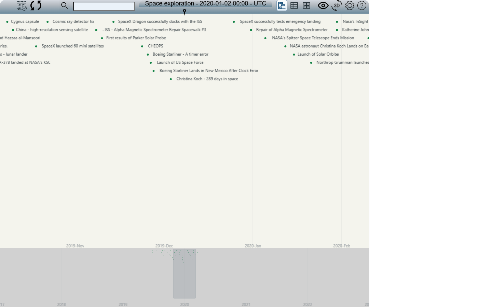
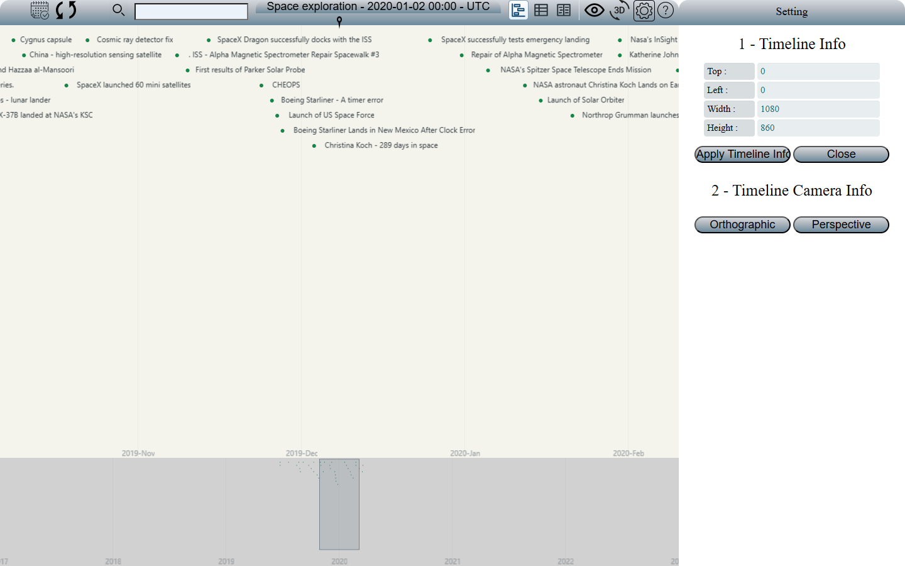

# Implementation prompt: timeline filtering, automatic scaling, and connected settings

## Release 2.0 checkpoint (2026-09-27)

Version 2.0 includes the resizable Data panel, buffered drag/calendar loading,
stable source-occurrence identities, red actionable loading errors, readable
Perspective rendering, and one top date axis per page by default. Calendar
navigation retains the selected interval through redraws and zooming; brief
rendering delays no longer discard a flick. `params.dateAxisMode: "per-band"`
explicitly enables separate band axes.

The release uses the existing GPL license. Connected resource browsing and
transactional YAML/model editing in phases 5–6 remain planned. See the
[release notes](docs/release-2.0.md) for scope, current verification, and packaging.
Private deployments and validation captures remain outside versioned files.

Use available OpenBEXI earthquake/volcano screenshots and the written scenario
below as the concrete reference. Extend the application's existing framework, renderer, data
model, search semantics, and performance controls.

These requirements also apply to other timeline applications, including activity
histories, project planners, monitoring dashboards, media timelines, and event
explorers. The earthquake/volcano data is the concrete reference, not a restriction
on supported datasets, frameworks, or renderers.

## Execution scope and reference availability

This document specifies implementation work; reviewing or editing it alone does
not mean that implementation or validation has happened. When asked to review the
prompt first, update this document and report the changes before modifying
application code. When implementation is requested, complete the inspection,
implementation, and validation below in reviewable steps.

Repository inspection on 2026-09-23 found that `docs/ui/generic-autoscale/` and
`yaml/earthquake_volcano_data.yml` are absent. Descriptions of those absent assets
are requirements supplied by the prompt, not observations verified in this checkout.
Treat those absent assets as optional references; do not claim to have inspected
them, create substitute evidence, or require them to begin implementation.
Use the checked-in hazard model and a deterministic mixed-hazard fixture if live
data or original captures are unavailable. Report fixture-based validation
separately from validation against a live provider.

## Privacy and generic implementation

Keep versioned code, documentation, tests, configuration examples, screenshots,
and generated reports independent of any private deployment. Do not include real
organization or site identifiers, private entry-page names, internal hostnames,
addresses, ports, source paths, user profiles, event content, or credentials.
Use public demo data or clearly labeled synthetic fixtures for shareable evidence.
Keep private runtime files and captures local and ignored by version control.
Replacing a filename does not anonymize the data or pixels inside it.

Accept deployment settings through existing configuration or explicit runtime
arguments. Tests must run without private models, services, or saved filters.
Before delivery, check both file contents and filenames in the tracked files and
the new files eligible for inclusion. Ignore rules do not remove tracked files or
erase their contents from earlier commits.

## Priority follow-up: navigation, descriptors, Overview and readable logs (2026-09-25)

Status: implemented and verified with public catalog data and synthetic connected
fixtures. The checkpoint below records the checks and remaining comparison limits.

Use the two newly supplied screenshots as evidence. The current application
shows a largely empty visible interval, an update failure with `Unexpected end
of JSON input`, and a descriptor whose description is blank. The legacy
screenshot shows a populated timeline and a detailed chronological description
for the selected record. Screenshots establish the visible symptoms; inspect
requests, responses and record contents before identifying their causes.
Keep the supplied screenshots, record values and deployment details local and
ignored. Use generic fixtures for public tests, documentation and captures.

### 1. Restore reliable, fast navigation into the past and future

- Fix dragging in both directions so newly visible time intervals populate
  promptly with their eligible sessions and events. Include long sessions that
  overlap the interval even when they began earlier. Respect the active filter,
  grouping, zoom and row pagination.
- Display cached records immediately and prioritize requests for missing data
  in the visible interval. Render useful batches as they arrive; background
  archive scanning and Overview loading must not delay the main view.
- Use one current visible time span on each side as the recommended default
  prefetch buffer. If the main view covers an interval of duration D, aim to keep
  eligible records ready from D before its start through D after its end: three
  view spans in total, including the visible interval.
- After the first useful visible batch, populate both neighboring buffers
  promptly without waiting for a complete archive scan. As the user drags,
  render cached records as soon as they enter the view, before mouse release,
  so navigation feels continuous and populated wherever source data exists.
- Replenish the buffers before navigation reaches their edges, prioritizing the
  direction of movement while retaining useful records on the opposite side.
  Recalculate their duration after zoom or viewport changes. Adapt the buffer
  within configured memory and request limits using data density, navigation
  speed and measured loading latency; never delay useful visible records merely
  to finish prefetching.
- Reuse overlapping results and avoid duplicate requests, unnecessary full
  reloads and expensive scene rebuilds during dragging. Preserve smooth motion
  and stop-on-click behavior. Verify dragging up to one buffered span in either
  direction without a new loading gap when that interval's data is cached.
- Investigate and fix the empty/truncated JSON response failure shown in the
  screenshot, including its producing request and server response. Handle empty
  responses according to the endpoint contract. Keep valid loaded records when
  a request fails, show an actionable error, and allow Retry without resetting
  the view. Do not treat a failed or incomplete response as a successful empty
  interval.
- Cancel superseded work and reject late responses during rapid direction or
  filter changes. Loading indicators must distinguish pending coverage from
  genuinely empty intervals while keeping usable controls responsive.
- Measure request latency, time from a drag to the first useful response and
  populated frame, time to fill the visible interval, and rendering work. Compare
  cold and cached navigation with equivalent data and time windows. Optimize the
  measured bottlenecks and report remaining provider/coverage limits.

### 2. Restore complete session and event descriptors

- Selecting a session or event must show all information available for that
  record, matching the legacy descriptor's content. Include identifiers, start
  and end times, title, status, source/category fields, additional metadata,
  linked reports, and the full description or chronological activity history
  when supplied by the provider.
- Compare the same selected record with the legacy tool and its detail response.
  Determine whether information is lost during loading, normalization, detail
  retrieval or rendering. If the timeline record is only a summary, retrieve its
  full descriptor through the existing provider interface.
- Preserve readable dates and time zones, multiline text, chronological order,
  supported formatting and usable links, following the existing safe rendering
  rules. Long content must wrap and remain accessible through scrolling inside
  the descriptor panel; it must not be silently truncated or omitted.
- Show a loading state while details are being retrieved. Distinguish a record
  with no description from a failed or incomplete detail response, with Retry
  where appropriate. Rapid selection changes must never display an earlier
  record's response as the current selection's details.
- Retain the consistent responsive panel width and styling. Support both events
  and sessions, including nested activities and records reached through paging.

### 3. Keep the Overview visible-window indicator centered

- Interpret the Overview "square" as the rectangle representing the main
  timeline's visible time window. Keep its horizontal center aligned with the
  center of the available Overview plotting area, accounting for docked panels.
- As the main view moves into the past or future, shift the Overview's displayed
  time context around this centered indicator. Preserve the Overview zoom span
  where possible and keep the indicator's width proportional to the main view's
  actual visible duration.
- Maintain accurate correspondence between the indicator, Overview records and
  main timeline. Centering must not change the main view's selected time range
  or falsely indicate that another interval is visible.
- Recalculate the center after browser resizing, panel opening/closing, layout
  changes, grouping, pagination and incoming batches. Keep the indicator visible
  and correctly aligned vertically within the Overview.
- Reconcile Overview dragging, wheel zoom, navigation arrows and Fit context
  with this centered behavior. Update affected interaction tests and help text;
  an existing assertion that permits an off-center indicator must not override
  this new requirement.

### 4. Provide readable server logs in the legacy console style

- Provide a human-readable server log format following the supplied legacy
  example, alongside the existing structured diagnostics. Make it easy to follow
  a UI action from its request URL through its response and resulting update.
- Log the HTTP method and request URL with useful query parameters for reading
  filters, applying filters/grouping, loading visible or prefetched records,
  continuing a batch and reading a descriptor. Include the requested time range,
  scene, timeline, filter, search, grouping and record identity when applicable.
  Build these values from the actual request and deployment configuration.
- Follow each request with a clear result such as `Response OK!`, its HTTP status
  and server processing duration. Failed requests must show their status, reason
  and operation. Identify empty or malformed bodies and descriptor failures
  clearly, even when the HTTP status alone indicates success.
- For data responses, report separate session and event counts, the batch number,
  whether more data is pending, and coverage warnings. Label per-response counts
  and cumulative unique counts distinctly so overlapping windows and replayed
  batches do not inflate totals. Keep descriptor and filter responses identifiable
  instead of presenting them as event batches.
- Include readable minimum, marker and maximum dates for the relevant view or
  request. Use unambiguous timestamps with UTC or an explicit offset. The marker
  is the actual client view marker when supplied; label it unavailable otherwise.
  Keep request bounds and the currently displayed view bounds distinguishable.
- Preserve useful browser diagnostics such as "populated ... and updated scene".
  Label their origin and distinguish browser request latency, scene population
  or rendering duration from server processing time. If these summaries are
  mirrored into server logs, use a small correlated client diagnostic report
  after the update; server response counts alone cannot establish what rendered.
- Include request/load identifiers and scene context so interleaved requests,
  cancellations, retries and stale responses can be traced. Investigate the
  undefined-value error shown in the example; log actionable error context and
  avoid emitting accidental `undefined` values in request parameters.
- Make verbosity configurable so detailed URL traces remain useful without
  flooding logs or slowing dragging and progressive loading. Keep deployment
  URLs, user/filter values and record identifiers in local diagnostic logs.
  Redact credentials and tokens. Public examples, code and committed captures
  must remain generic, as required by the privacy section above.

Illustrative format using synthetic values; durations and counts below are
examples, not measurements:

```text
[server request=req-1] POST https://example.test/openbexi_timeline/sessions?ob_request=readFilters&scene=0&timelineName=sample&sortBy=NONE
[server request=req-1] Response OK! HTTP 200; settings and filters returned; server=12 ms
[server request=req-2 load=load-1] GET https://example.test/openbexi_timeline/sessions?startDate=2026-09-12T12%3A00%3A00Z&endDate=2026-09-12T13%3A00%3A00Z&scene=0&filterName=Warnings&sortBy=namespace
[server request=req-2 load=load-1] Response OK! HTTP 200; returned 3 sessions, 18 events; batch=1; server=42 ms; more=true; coverage=partial
[server request=req-2] request min=2026-09-12T12:00:00Z; marker=unavailable; request max=2026-09-12T13:00:00Z
[client request=req-2 scene=0] Populated 3 sessions, 18 events in 16 ms; updated scene 0
[client scene=0] view min=2026-09-12T12:00:00Z; marker=2026-09-12T12:30:00Z; view max=2026-09-12T13:00:00Z
[server request=req-3] POST https://example.test/openbexi_timeline/sessions?ob_request=readDescriptor&scene=0&event_id=sample-event
[server request=req-3] Response OK! HTTP 200; descriptor returned; server=8 ms
```

### Verification and delivery

Verify repeated drags in both directions, fast reversals, slow or failed responses,
and cached revisits using equivalent source data, filters and time zones. Check
record identities and coverage after navigation. Compare a complete event and
session descriptor with the legacy reference, including long descriptions and
rapid selection changes. Check Overview centering and accurate time mapping at
desktop and narrow sizes with panels open and closed.

Verify the readable logs for startup, dragging in either direction, selecting a
filter and opening a descriptor. Include delayed, cancelled, empty and failed
responses. Reconcile logged counts and time bounds with actual responses and
client reports, and confirm that detailed logging does not materially delay
navigation. Update the connected-diagnostics documentation after implementation.

Retain prior filtering, grouping, pagination and loading behavior. Add focused
regression tests and real before/after browser captures. Keep private evidence
local; publish only public or synthetic examples. Update README visual references
and feature descriptions after implementation and verification. Report measured
improvements and unresolved limitations without claiming instant or complete
loading when the source cannot provide it.

### Implementation checkpoint (2026-09-25)

- The loader now covers the visible interval and a default one-span buffer on
  each side using reusable aligned windows. Both neighbors start after useful
  visible data arrives. Direction and measured latency guide replenishment;
  density limits pause background work with a partial-coverage warning. Cached
  records remain visible while requests fail, cancel or become obsolete.
- Runtime reproduction with synthetic files exposed rejected ISO dates and
  descriptor serialization that removed brackets from content and nested arrays.
  Shared date parsing and intact JSON serialization fix those paths. HTTP tests
  cover ISO/legacy dates, invalid input, missing and malformed descriptors, and
  both session routes. A standalone Java probe returned the expected event and
  complete descriptor after the fixes.
- Descriptors load independently, preserve metadata and formatted history, and
  keep the selected summary visible during loading or retry. A late response
  cannot replace the current selection. Current browser evidence includes a
  40-line history, links and responsive panel scrolling.
- Overview follows the actual main interval with a centered, proportional
  indicator, while preserving its own zoom duration. Both drag directions,
  controls, multiple bands, panel docking and resizing are covered. Narrow
  panels end above the Overview footer.
- Readable request and response logs accompany structured summaries by default.
  They include request/load IDs, scene, operation, status/reason, processing time,
  counts, coverage and request dates. Optional local query detail excludes
  credentials and cursors. Browser logs distinguish request latency and scene
  construction from server processing; they do not claim to measure a screen
  paint. See [diagnostic configuration](docs/connected-diagnostics.md).
- `npm test` passed all 129 JavaScript tests. Maven `verify` passed 52 executed
  tests, with 34 existing environment-dependent skips; the final HTTP-status
  logging adjustment also passed its focused tests and packaging. The full
  browser suite passed 67 tests with seven duplicate narrow drag cases skipped.
  All 16 final focused browser checks passed after the last client adjustments.
  All 14 catalog screenshot comparisons also passed without updating baselines.
  Real mouse tests verify continued movement, click-to-stop, retained rendering
  objects and zero scene rebuilds while dragging cached records.
- Current [Overview captures](docs/ui/overview/README.md),
  [descriptor captures](docs/ui/navigation-details/README.md), README references
  and help describe the implemented behavior. Captures use the installed
  Chromium 149/SwiftShader fallback; the managed-browser CI comparison remains
  a release check. See [measurements and bounds](docs/progressive-loading.md)
  for the synthetic comparison and resource limits.
- The privacy audit found no prohibited deployment identifiers in eligible
  filenames, text, or the current index. Shared captures use only public or
  synthetic records. An existing private README image was removed from the
  document and preserved in ignored local storage. Source packaging rejects
  document image references outside the explicit public manifest. Runtime probes,
  logs and baseline measurements remain
  local and ignored. This check does not erase or certify earlier history.

Complete private-archive coverage, production first-frame timing and exact
record-for-record descriptor parity with a live legacy deployment remain
unverified. File sources without an index can still require archive scanning
for overlapping long sessions; configured limits remain visible as partial
coverage. Synthetic measurements are evidence of scheduling behavior, not a
promise of instantaneous loading from every provider.

## Previous follow-up: restore legacy startup and saved-filter behavior (2026-09-25)

Status: implemented and verified for the tested intervals and fixtures; the
checkpoint below records remaining coverage and comparison limits. The changes
retain responsive layout, pagination, progressive loading and Overview.

Use the user's supplied legacy checkout and running legacy URL as read-only
references. Use the three supplied screenshots as visual evidence: the first
shows labeled, colored namespace bands; the second shows the combined timeline;
the third shows the exclusion preset selected with Sort by set to `NONE`.
They show different time windows and cannot establish equal record counts or
startup timings. Inspect the actual saved-filter definitions and legacy execution
path before deciding which behavior must change. Keep deployment paths, URLs,
page names, preset names and screenshot contents local and out of public files.

### 1. Restore prompt, populated startup

- Opening the configured current entry page should show eligible sessions and
  events in its initial visible interval as soon as the first useful batch arrives,
  comparable to the legacy application using the same available source data.
- Restore the saved active filter and its grouping consistently before presenting
  filtered results. Do not require a manual refresh, re-selection of the preset,
  or navigation away and back to populate the timeline.
- Prioritize the visible interval and render incrementally; background archive
  and Overview loading must not postpone useful content. Preserve clear loading,
  empty, partial, disconnected and failed states, with Retry where appropriate.

### 2. Restore the legacy ungrouped exclusion preset

- Selecting the supplied exclusion preset must apply its actual legacy conditions
  and show the remaining sessions/events together, with Sort by set to `NONE`
  when that is the preset's saved setting, as illustrated in the third screenshot.
- Preserve the legacy interpretation of compound expressions, exclusions, field
  matching and nested session/activity filtering. Do not infer those rules from
  the preset's name or the partly visible expression in a screenshot.
- Retain eligible records' icons, colors, titles, durations and relationships.
  The same rules must apply to initial, prefetched and subsequently loaded batches.

### 3. Restore the namespace-grouped exclusion preset

- Selecting the supplied namespace preset must apply its saved exclusion rules
  and namespace grouping together, rebuilding separate labeled, colored bands
  like the first screenshot. The Sort by control must reflect the applied setting.
- Verify both presets' definitions. Where their exclusion rules are equivalent,
  grouping should change presentation without changing eligible record identities.
- Switching between presets or changing Sort by must update the live timeline
  without reloading the page. Preserve the current time window and zoom; keep
  Overview and pagination consistent, and retain selection when still eligible.
- Implement shared, configuration-driven behavior; do not add branches keyed to
  private preset names, datasets, namespaces or entry pages.

### 4. Compare against the working legacy behavior

- Compare both applications using equivalent source snapshots, time intervals,
  time zones, saved expressions and grouping settings. Distinguish missing source
  coverage from filtering, grouping, request or rendering regressions.
- Verify eligible identities and separate session/event counts, excluded records,
  namespace membership, visual attributes and switching in both directions.
  Check startup restoration, delayed batches, past navigation and stale-response
  rejection; an obsolete load must not restore a previously selected filter.
- Measure time to the frame, first useful response and first rendered records
  separately. Report partial coverage and unavailable sources honestly; passing
  synthetic fixtures alone does not prove the reported deployment is fixed.
- Add generic regression fixtures and capture real before/after browser evidence.
  Keep private comparisons ignored and local; publish only public or synthetic
  examples. Report confirmed causes, changes, validation and remaining limits.

### Implementation checkpoint (2026-09-25)

- Both file loaders resolve a record's explicit namespace, then its legacy
  `data.namespace`, then its parent's/provider's fallback. A mixed source no
  longer collapses into the provider's namespace. Styling and record IDs survive.
- Legacy exclusions inspect the complete nested session before returned
  activities are limited to the requested interval. Cursor counts describe the
  returned activities, including when outside-window context affects filtering.
- Startup restores the active preset's name, expression and grouping together.
  The radio selection and Sort by control follow the active preset, including
  when opening or rebuilding the panel. Profiles with no active preset start
  unfiltered instead of failing on an undefined expression.
- Equivalent presets retain already loaded records while cancelled scans
  restart. Grouping preserves selection and visible time range. Cache reuse is
  scoped by source configuration, user, timeline, expression and search; changing
  those rules or explicitly refreshing discards the cached scope.
- A controlled, read-only HTTP comparison returned the same 55 record IDs as the
  legacy server for the tested three-hour interval, with no missing/extra IDs or
  changed namespaces/render attributes. The original loader overwrote 11 explicit
  legacy namespaces in that sample. Private profiles and captures remain ignored.
- The current connected page populated without interaction and switched both
  ways between the supplied presets. One controlled run observed the frame at
  approximately 1.56 s, the first useful response at 2.29 s, and a populated frame
  at 2.30 s. These are local observations, not performance guarantees or a
  cold-cache benchmark. A separate direct HTTP run returned useful data in 0.17 s.
- Automated validation passed 124 JavaScript tests, 10 focused desktop/narrow
  browser checks, and Maven verification: 50 executed tests, 34 existing
  environment-dependent skips. Public captures use synthetic responses and the
  real WebGL renderer; see [saved-preset evidence](docs/ui/saved-presets/README.md).
- Limits: unavailable sources and invalid archive records still produce explicit
  partial coverage. Background scans were bounded; complete archive parity is
  not established. The isolated legacy-browser probe did not reach a populated
  frame, so startup speed parity is unverified; its HTTP output and the supplied
  screenshots remain the legacy references. The installed Chromium fallback was
  used for browser checks; managed-browser CI remains a release requirement.

## Previous follow-up: current visual references, independent zoom, readable Overview, connected startup, and server diagnostics (2026-09-25)

Status: implemented, with verification and deployment limits recorded below. This
follow-up supersedes earlier requirements that make Overview wheel gestures zoom
the main view or force Overview to display the entire analysis domain at all times.
Earlier implementation checkpoints describe their tested fixtures; they do not
establish that the newly reported connected-startup problem is resolved.

Use the supplied cropped Overview screenshot as the visual target for discernible
event marks, session bars, and the main-view range indicator. It is a visual
reference, not evidence of wheel behavior, startup timing, or complete data coverage.
Use the user's reported local configuration and entry page privately when
investigating startup. Keep their names, paths, data, and screenshots out of public
code, documentation, tests, and generated artifacts.

### 1. Update the README visualization references

- Refresh the screenshot links and previews in [README.md](README.md), including
  the release introduction, the Live Demos table's Visual reference column, and
  Visualization Examples, so they show the current application after these fixes.
- Capture the actual application with public demo data or synthetic fixtures.
  Show the current toolbar, main view, readable Overview, viewport indicator, and
  loading state where relevant. Record the dataset, time range, viewport, and
  reproduction command. Include desktop and narrow layouts.
- Clearly distinguish any retained historical/design reference from current UI
  evidence. Do not present old captures as the latest implementation or replace
  real screenshots with generated mockups.
- Keep the demo catalog and README generator consistent with the updated links;
  regenerating the Live Demos section must not restore obsolete references.
  Check that every linked image exists and renders correctly.

### 2. Zoom only the plot under the mouse pointer

- Scrolling up zooms in and scrolling down zooms out in the plot under the pointer.
  Normalize wheel and trackpad input and preserve the real timestamp under the
  pointer while applying bounded, smooth scale changes.
- Over the main view, change only that view's time range and scale. Keep the
  Overview time range and magnification unchanged; update its viewport indicator
  to reflect the new main-view range.
- Over Overview, change only the Overview time range and scale. Preserve the
  main view's time range, zoom, Auto scale state, selection, and vertical page.
  Reproject Overview records and the viewport indicator using its own axis.
- Keep independent scale state for the main view and each Overview. Do not route
  both wheel handlers to an operation that always changes the main view. Preserve
  intentional main-view navigation through Overview clicks or viewport dragging.
- Apply the same targeting rule with Auto scale on or off, across local and
  connected timelines, and with panels open or closed. Main-view adaptive scaling
  must not turn into an unintended Overview zoom.
- Consume wheel gestures only over timeline plots. Menus, Settings, Help, Data,
  and other scrollable content retain normal scrolling. Keep keyboard/button
  navigation accessible and make the affected plot clear in tooltips/help.

### 3. Make Overview detail readable by default

- For every timeline with Overview enabled, provide useful event/session detail
  immediately, comparable to the supplied screenshot. Apply shared defaults to
  local and connected models while respecting explicit model/Settings overrides.
- Choose a useful initial Overview range from the main view, available records,
  density, and panel width. Avoid automatically compressing an entire long history
  into an unreadable strip. Keep the broader loaded context reachable through
  Overview navigation and an accessible way to fit that context again.
- Balance Overview height, row spacing, marker size, stroke width, and contrast so
  short events and session bars remain distinguishable. Use bounded aggregation
  when density requires it, with counts/details available; do not silently omit
  eligible records or stretch session durations to make them look longer.
- Preserve real timestamps, source colors, session relationships, and a linear
  Overview time axis. Derive the main-view range indicator from actual visible
  timestamps, including when that range extends outside the Overview window.
  Clipping or edge cues must not imply that the main view has moved.
- Recalculate layout on resize and refine initial defaults as useful batches
  arrive. Once the user manually pans or zooms Overview, preserve that choice
  during later loading and main-view navigation until an explicit reset.
- Identify partial coverage. The loaded analysis scope and the displayed Overview
  window are separate: zooming Overview must not alter filters, counts, or stored
  data, and readability must not depend on loading the complete archive first.

### 4. Fix the empty connected timeline and prioritize useful records

- Reproduce the reported startup using the configured Java timeline service and
  its associated local HTML entry page. The current symptom is an empty timeline
  even though sessions/events are expected. Trace the actual startup path before
  choosing a fix; do not treat passing static demos as proof of connected behavior.
- Verify configuration loading, the selected provider/source, endpoint and
  transport selection, saved filters/grouping, initial timestamps and time zone,
  request parameters, response metadata, and client rendering. Resolve the cause
  generically, without hard-coding a deployment, source, date, or private filename.
- Build the frame immediately and request records intersecting the initial main
  window first, including long sessions that began earlier. Display the first
  useful batch as soon as it arrives. Do not wait for full-history scanning or
  Overview completion before showing the main view.
- After the first useful records render, prefetch a bounded adjacent past interval
  early enough to support the first backward drag, then nearby future/context
  intervals. Cached records should appear immediately when entering that range.
  If the user outruns prefetch, prioritize the requested interval, preserve the
  coherent rendered view, and show a clear loading state instead of a black gap.
- Build Overview progressively from available records using the readable defaults
  above. Schedule its additional context work behind visible-window requests;
  neither Overview loading nor background prefetch may lock main-view interaction.
- Preserve stable IDs, nested sessions, filters, grouping, selection, and time
  ranges across batches. Cancel obsolete requests and reject stale responses
  during dragging, zooming, filter changes, and reconnects. Bound retrieval work,
  concurrency, and retained memory.
- Distinguish loading, confirmed-empty, disconnected, and failed states. Report
  useful errors with Retry. If the requested interval contains no records, explain
  that state and offer navigation to an available interval when known; do not
  silently change a configured date or invent records. Keep local-data startup
  working when the data server is unavailable.

### 5. Log the web-page URL and explain UI-related REST activity

- Once the relevant listener is ready, print a clearly labeled, complete URL that
  the user can copy or open to launch the configured timeline page. Derive the
  protocol, browser-accessible host, effective port, context path, and actual
  entry-page filename from runtime configuration. Use the UI's address when it
  differs from the data/API service, including an explicitly configured external
  base URL. Do not announce a failed listener as ready or guess a page extension.
  Public documentation may show the illustrative form
  `Web UI ready: https://localhost:<configured-port>/<configured-page>`; local
  runtime logs must contain the resolved URL. Keep deployment-specific values in
  local configuration rather than hard-coding them in shared source or examples.
- Make server request/response logs useful for diagnosing UI startup, dragging,
  zooming, filtering, grouping, Overview loading, and retries. Cover the actual
  timeline HTTP/SSE routes used by the UI, and API v1 where applicable; a generic
  HTTP access line alone does not explain which data was returned.
- Include a timestamp, request/correlation ID, HTTP method, endpoint path, logical
  operation, requested time interval, safe source/provider identifier, relevant
  grouping/filter state, HTTP status, logical outcome, and elapsed milliseconds.
  Identify initial-view, past/future prefetch, Overview, or retry work when that
  purpose is supplied by the client; do not infer it incorrectly from a shared URL.
  Correlate continuation requests with the same logical load.
- For each data batch or response, log separate **sessions returned** and
  **events/activities returned** counts using the application's existing counting
  rules. Distinguish records examined, records excluded, records returned, and
  any available cumulative unique totals. Avoid double-counting nested activities,
  overlapping batches, replayed cursors, or repeated live snapshots. If a count
  is unavailable, label it as unknown rather than reporting an invented zero.
  Responses sent by the server must not be described as records rendered by the
  browser unless there is actual client confirmation.
- Include batch number, whether more pages remain, complete/partial coverage,
  and cache status where known. Clearly distinguish successful empty results,
  missing/unavailable sources, timeout, cancellation, expired continuation, and
  failed requests. Report a logical failure even if the existing transport uses
  HTTP 200 with an error envelope. Never log an empty result as a successful
  completed load when more work or a source error explains the missing records.
- Use concise, consistent INFO summaries and configurable DEBUG detail, with
  appropriate warning/error levels. Keep logging bounded during rapid navigation
  and long-running streams; do not add a full scan just to calculate diagnostics.
  Reuse the existing logging framework and redact credentials, tokens, cookies,
  raw record contents, and sensitive query/path values. Public log examples and
  test fixtures must contain only generic or synthetic values.
- Expand the README's REST API guidance, linking to the detailed API documentation
  as needed. Explain which endpoints and methods the UI actually uses, their
  important parameters, pagination/loading metadata, session/event count meanings,
  and how to follow a UI action through correlated logs. Include public sample
  request/response and startup/load log examples, and distinguish supported
  behavior from planned functionality.

### Verification and delivery for this follow-up

1. Use real wheel/trackpad interactions over both plots. Assert the target range
   changes in the correct direction, the timestamp under the pointer stays anchored,
   and the other plot's range/scale remains unchanged. Check the main-view indicator,
   rapid opposite gestures, Auto scale on/off, and normal scrolling inside panels.
2. Check Overview readability with sparse/dense data, short events, long sessions,
   multiple bands, numeric and date axes, partial batches, and browser resizing.
   Verify that later batches do not undo a manual Overview zoom.
3. Exercise cold connected startup with known records in the initial and adjacent
   past windows. Delay Overview and later batches; prove that current records
   render first and that the first backward drag can use prefetched data. Also
   test navigation beyond the cache, empty intervals, failures, and reconnection.
4. Exercise the actual configured provider path where available, plus a shareable
   synthetic equivalent. Record time to the frame and first useful records,
   first-backward-drag cache behavior, batch sizes, and bounded retrieval work.
   Report any untested private runtime path explicitly.
5. Verify that startup logs provide the correct reachable UI URL for configured
   HTTP/HTTPS, context paths, and separate UI/data addresses. Exercise real UI
   requests against synthetic server data; reconcile logged session/event counts
   with responses, including nested records, exclusions, pagination, replay,
   empty results, and failures. Check correlation, redaction, and bounded output.
6. Refresh the README references and REST/logging guidance with real post-change
   evidence and public examples, and validate the
   generated section and links. Keep private evidence local. Report the confirmed
   startup cause, implemented behavior, measured results, and remaining limitations;
   update this status only after implementation and the corresponding checks.

### Implementation checkpoint (2026-09-25)

- README and catalog references now link to [actual current browser captures](docs/ui/overview/README.md)
  of public datasets and synthetic connected/dense fixtures. Main and Overview
  wheel gestures preserve independent pointer-anchored ranges, including Auto
  scale, resize and later batches. Overview defaults refine from useful records;
  authored/manual ranges persist. Marks have bounded minimum thickness,
  count-preserving aggregation, independent context navigation and Fit context.
- Debugger observations on the reported local provider confirmed that startup
  applied a display-time-zone offset to the initial request, placing its window
  ahead of the real current time. Connected initialization now uses real instants
  before its first response and enables configured Overview bands by default.
  Server formatting no longer changes the JVM-wide time zone during requests.
- Progressive loading displays useful batches immediately, schedules an early
  adjacent-past page, retains bounded cached windows and rejects obsolete loads.
  The frame and interaction remain available during background work. Empty or
  partial intervals can offer explicit navigation to an observed source interval.
- In one local live-provider observation, the first nonempty response arrived
  after 2.34 seconds and a past-prefetch response after 2.54 seconds; three unique
  events and an Overview were subsequently present. These are response timings,
  not measured first-paint guarantees. In a later observation the frame appeared
  about 1.42 seconds after instrumentation began, but its then-current interval
  produced no useful records within 6.5 seconds. One configured source remains
  unavailable, and archive coverage remains partial. Restoring that source is
  deployment work; these checks do not establish complete archive coverage or
  immediate records in every interval. Private observations remain local.
- The configured launch URL was logged and its page was reachable. A local-only
  `web_ui` setting selects the actual page/listener. Shared code accepts generic
  settings and emits correlated, bounded HTTP/SSE/API response summaries with
  separate session/event counts. See [REST operations and logging](docs/connected-diagnostics.md)
  and [progressive retrieval limits](docs/progressive-loading.md).
- Validation passed 122 JavaScript tests, 61 browser checks (seven duplicate
  narrow drag cases skipped), and Maven verification with 48 executed tests and
  34 existing environment-dependent skips. Real HTTP tests reconcile response
  counts with logs; synthetic browser tests hold continuations while current and
  prefetched past records remain usable. The installed Chromium fallback and
  screenshot reproduction details are disclosed with the captures. Generated
  README/schema checks, model validation and public-file privacy checks passed.

## Previous follow-up: progressive loading, standalone startup, legacy filters, and UI consistency (2026-09-24)

Status: implemented and verified using public/synthetic fixtures on 2026-09-24.
The JSON-file provider now returns resumable batches; local/server-independent
startup, saved filtering and grouping, consistent panels, collapsible Help,
direct dataset selection, and the date-axis/toolbar fixes are implemented.
Validation includes 121 JavaScript tests, 53 distinct browser checks across full
and focused runs, and Maven verification with 46 executed tests and 34 existing
environment-dependent skips. See [implementation details and limits](docs/progressive-loading.md)
and [real browser evidence](docs/ui/progressive/README.md). Alternate providers
retain compatibility; progressive retrieval was verified on the JSON-file provider.
The installed-browser compatibility fallback and measurement limits are documented
with the evidence; private live deployments were not used for validation.

The original report concerned regressions in connected Timeline Filtering and
Sort by despite the earlier checks below. Use the supplied filtering screenshots as visual references for
the saved-filter panel and grouping by `series`; confirm filter semantics against
the working legacy implementation and configuration. Screenshots alone do not
establish the underlying inclusion/exclusion rules. Keep their private names,
data, and image files outside versioned documentation and test fixtures.

### 1. Display the current time window first and load remaining records progressively

- Render the toolbar, time axis, and timeline frame immediately. Prioritize events
  and sessions intersecting the currently visible time window, including sessions
  that start before it and continue into it. Display the first useful batch as
  soon as it arrives, without waiting for the complete dataset.
- Make the server retrieve and return small, bounded batches with a continuation
  mechanism. Bound both retrieval work and response size; splitting a response
  after reading the entire dataset does not meet this requirement. Inspect the
  active provider and client together, keeping existing providers compatible.
- Once current-window records are visible, prefetch nearby past and future
  intervals at lower priority. Keep concurrency and memory bounded. When the
  user pans or zooms, prioritize the new visible window and cancel or deprioritize
  obsolete work. Avoid eagerly reading the full history.
- Merge batches incrementally using stable record identities. Preserve session
  relationships, the visible time range, selection, active filters, grouping,
  and pagination. Reject stale responses after query changes and prevent duplicate
  or missing records across overlapping batches.
- Keep the rendered timeline usable during background loading. Show a compact,
  accessible loading/progress state, with cancellation and retry where applicable.
  Restrict only actions that conflict with an unfinished foreground operation;
  background prefetch must not lock the whole interface or clear the last view.
- Distinguish loaded, still-loading, failed, and confirmed-empty intervals.
  Indicate partial coverage and provisional counts. Overview, search results,
  grouping, and Auto scale must not claim complete coverage from a partial batch
  or unexpectedly reset the user's view when later batches arrive.

This requirement refines the earlier loading lock: background requests must not
block interaction, and initial rendering must not depend on full-dataset loading.

### 2. Make UI startup independent of the data server

- Initialize the interface when the data server is stopped, starting, unreachable,
  or disconnected. A connection attempt, saved-filter request, or missing server
  response must not prevent the timeline frame and controls from appearing.
- When the model configures locally accessible data, retrieve and display it
  independently of the server. Preserve the existing static/local data workflow;
  do not replace a configured local source with a mandatory remote request.
- Without available data, show a clear disconnected or empty state and a reconnect
  action instead of a black screen or an indefinite loading indicator. Preserve
  already displayed records if the connection drops, and identify stale data.
- When the server becomes available, reconnect without requiring a page reload
  or resetting the visible time window, selection, grouping, and filters. Keep
  server-only controls clearly unavailable until their dependencies are ready.

### 3. Restore legacy Timeline Filtering and Sort by behavior

- Restore the saved-filter list and its selection behavior in the Sorting &
  Filtering panel, including existing create, edit, and delete actions where
  supported. Keep stored filter definitions compatible and display failures with
  a useful retry action rather than silently clearing the list or timeline.
- Reproduce the saved namespace/exclusion filter shown in the first screenshot
  using an equivalent synthetic fixture. Apply its actual legacy inclusion and
  exclusion rules, and its saved grouping/model settings when present. Do not
  substitute text search or highlighting for record filtering.
- Restore dynamic grouping by `series`, as shown in the second screenshot, as
  well as namespace, session/event type, and other supported legacy fields.
  Applying Sort by must build distinct labeled bands with the corresponding
  records and compatible configured ordering/styles; changing a heading alone
  is insufficient. Preserve the legacy handling of missing values and nested
  sessions/events, including the fallback group where applicable.
- Filtering and grouping must work together. Changing Sort by retains the active
  exclusion rules; selecting a saved filter restores the settings that filter
  actually stores. NONE removes explicit grouping without clearing the filter.
  Preserve the current time range, zoom, search, and valid selection.
- Synchronize the visible bands, table, pagination, Overview, and count/coverage
  indicators with the same effective filter and grouping. Verify this with the
  connected legacy data path as well as local datasets and progressive batches.
  Do not hard-code private filter names, fields specific to one deployment, or
  expected record IDs into the application.

### 4. Standardize panel sizing, dataset selection, and Help sections

- Give the Calendar, Settings, Help, and Data descriptor panels the same shared
  width policy. On desktop, aim for one fifth to one quarter of the browser width
  (approximately 22% by default), with sensible minimum and maximum widths so the
  calendar grid, labels, forms, and record details remain readable. Switching
  between panels should not produce arbitrary width changes.
- On smaller screens, use the available width with a bounded overlay or full-width
  panel. Keep the panel header and close control reachable. Allow long panel
  contents to scroll internally without introducing horizontal page overflow or
  scrollbars on the timeline plot. Resize correctly with the browser window.
- Consolidate the shared CSS for panel headers, typography, spacing, backgrounds,
  borders, form controls, buttons, focus states, and disabled states. Apply it to
  the Data descriptor as well as Calendar, Settings, and Help. Wrap long values
  and labels without hiding important content or overlapping controls.
- Remove the **Open dataset** button. A committed change in the dataset combo box
  should open the selected dataset immediately, using the existing loading and
  error feedback. Support mouse and keyboard selection, avoid duplicate loads,
  and ensure late responses cannot replace a more recently selected dataset.
  Keep the selector and the displayed dataset consistent after success or failure.
- Make every Help content section independently collapsible, including nested
  sections where present. Use clear headings with keyboard-accessible expand and
  collapse controls and an exposed expanded/collapsed state. Preserve the user's
  choices while Help is open and the timeline redraws. All existing Help content
  and actions must remain available inside the relevant section.

### 5. Remove duplicate date rows and restore the complete toolbar

- Use the supplied date-axis screenshot as evidence of two adjacent time-label
  rows at the boundary between the main view and Overview. Display one clear
  date/time axis for that current view span instead of repeating the same axis
  in a second strip. Find and fix the duplicate rendering/layout path rather
  than concealing labels with clipping or an overlapping element.
- Preserve the contrast and spacing of the remaining date row. Distinct bands or
  an Overview covering a different time range may retain their own necessary
  axes, but must not repeat the current-view axis in adjacent redundant rows.
  Verify both uniform and automatic scaling, with Overview enabled and disabled.
- Restore a consistent, complete menu bar across local demos, standalone startup,
  and connected timelines. Audit Calendar, refresh/navigation, Filter, Search,
  zoom +/-, Auto scale, Timeline/Table/Split, Overview, 3D, Settings, Help, and
  connection controls against the existing toolbar specification. Do not lose
  controls because of a different dataset, initialization path, or panel state.
- Keep controls visible and accessible when their dependencies are temporarily
  unavailable, using an appropriate disabled state and a short explanation.
  On narrow screens, wrap or use an accessible overflow menu instead of clipping
  icons. Retain the original search magnifier, the requested separators, and a
  readable title whose gray background follows its text width.

### Verification and delivery

1. With a large synthetic dataset and delayed later batches, prove that the UI
   frame and current-window records appear before the remaining records finish
   loading. Record startup timing, time to first visible records, batch sizes,
   and server retrieval work before and after the change.
2. Pan or change filters during loading; verify reprioritization, stale-response
   rejection, cancellation/retry, complete session handling, and stable navigation.
3. Start with the server unavailable: configured local data must still render.
   Also test no local data, disconnection after loading, and successful reconnection.
4. Compare legacy saved-filter results and `series`/namespace band membership with
   the new implementation using the same synthetic records, including exclusions,
   missing fields, nested records, repeated changes, and partial batches.
5. Compare Calendar, Settings, Help, and Data descriptor widths and shared styles
   at desktop and narrow sizes. Verify long content, keyboard focus, browser
   resizing, every Help section's collapse control, and dataset switching directly
   from the combo box, including rapid changes and load failures.
6. Check the previously affected views for duplicate date rows and missing toolbar
   controls. Cover local/connected/disconnected states, Overview on/off, automatic
   scaling on/off, panel changes, and responsive layouts.
7. Provide real browser screenshots using public/synthetic data and report which
   paths were exercised. Preserve the existing date contrast, drag momentum,
   full-window layout, and paging behavior. Update implementation status only
   after the corresponding code and verification are complete.

## Previous interaction checkpoint (2026-09-24)

Implemented in the shared renderer, Results controller, grouping and pagination.
The checkpoint passes 115 JavaScript tests and 43 distinct browser checks,
including 14 desktop/narrow screenshot comparisons without baseline updates
(seven duplicate narrow drag cases intentionally skipped). Real public captures
and reproduction instructions are in [version 2 evidence](docs/ui/v2/README.md).

Retain these regression requirements in the shared timeline code:

1. Give date ticks a dedicated, high-contrast strip with a separator and enough
   reserved height to keep event/session rows clear. Prevent adjacent date labels
   from colliding in both legacy and normalized layouts, including resized pages.
2. Use recent pointer velocity and elapsed time for a longer, smoothly decelerating
   coast toward the past or future. A quick flick should travel farther than the
   previous half-viewport limit. A click or new drag stops it immediately. Honor
   reduced motion and retain continuous plot coverage, time and zoom.
3. Show an accessible loading indicator during connected requests. Retain the last
   rendered view and block conflicting input until the request finishes. Keep
   cancellation available, reject cancelled/stale responses, and provide Retry
   after failure. Defer resize reconstruction until the request settles.
4. Restore dynamic Sort by for namespace, session/event type, and available data
   fields. Rebuild main bands, Overview and pagination together. Children use
   their own category when available and otherwise inherit their parent's category.
   Preserve record identities, search, selection and visible time range. NONE
   restores the ungrouped view; grouping must not hide the Overview controls.

Validate with public or synthetic records, delayed/failed connected responses,
real mouse input, desktop/narrow views and actual browser screenshots. Keep all
deployment-specific data and references outside versioned code and documentation.

## Priority follow-up: connected navigation and toolbar (2026-09-24)

The following corrections to phases 2–4 are implemented; see the
[navigation verification notes](docs/ui/connected-navigation/README.md). Retain these requirements
as regressions before proceeding to phase 5. This section supersedes earlier
requirements for a Results dropdown, an always-expanded count/status row, and a
text label replacing the original search icon. Historical checkpoints describe
earlier validation; the new connected checkpoint below records this follow-up's checks.

### 1. Restore smooth dragging and eliminate black areas

In a connected timeline, dragging toward the past or future has become less fluid.
Restore the behavior of the previous working version: after the pointer is
released, the visible time window should continue moving briefly in the same
direction, then slow smoothly to a stop. Keep the timeline responsive throughout
the drag and this short continuation. A new drag or navigation action must stop
the previous movement immediately; respect the user's reduced-motion preference.

Investigate and fix the intermittent black area shown in the supplied screenshot.
The timeline background, time axis, event rows, and overview must remain correctly
rendered during dragging, continued movement, loading, and resizing. An interval
with no events should still display a valid timeline background and axis. Preserve
the last valid view during updates, and prevent late responses or redraws from
resetting the user's position. Identify the cause before changing rendering code.

Verify both directions with Auto scale on and off, in context and matches-only
views, including repeated drags and connected HTTP/SSE updates. The screenshots
show the visual defect; motion requires an actual interaction check or recording.

### 2. Restore the search icon and simplify the toolbar

Keep the original magnifying-glass search icon and adjacent input, with the
appearance and alignment shown in the reference screenshot. Preserve the existing
navigation controls and search behavior.

When the user enters a search, show a compact contextual row below the main
toolbar. Replace the Results dropdown with a labeled **Highlight matches**
checkbox, checked by default. Unchecking it removes search emphasis in both the
main timeline and overview without changing which records are displayed. Preserve
the existing matches-only feature through a separate **Show only matches**
checkbox, unchecked by default; do not make disabling highlighting hide records.

Remove verbose event-count text from the default toolbar layout.
Keep full event/session counts and source diagnostics available through an
expandable **Search details** control. Show necessary loading, partial-data, and
error feedback concisely, with accessible details. Keep Fit matches and Clear
search easy to reach. Clearing the search collapses the contextual row when no
other matching condition remains, while retaining independently relevant warnings
and access to Auto scale and normal navigation.

Rebalance CSS spacing, control alignment, and title dimensions. The main title
(**"Timeline report ..."**) must have enough width, height, line height, and padding
to remain readable. It must not be compressed into a thin strip, clipped, or
overlapped by controls. Wrap controls appropriately on smaller screens and reserve
space for the contextual row and scaling strip without covering the timeline.

### 3. Refine toolbar grouping and title background

**Status: implemented in 2.0.0-rc.1.** Add a subtle vertical separator
immediately before the filter icon and another immediately before the overview
icon. Use consistent separator height, color, and spacing, aligned with the icon
row. Separators are decorative and must not receive keyboard focus.

Move the existing **+** and **−** zoom buttons directly beside the search text
input, in the order **Search input → + → − → Auto scale**. Keep the original
magnifying-glass icon immediately before the input. Move the existing buttons
rather than adding duplicates; preserve their behavior, accessible names, and
tooltips. This order supersedes the earlier instruction to place Auto scale
immediately after the search input.

Size the title's gray background to the rendered title text plus modest,
consistent padding. Do not stretch the gray area across unused toolbar space.
Keep the title readable and centered in its available area, retaining sufficient
height and line spacing. Recalculate its natural size when the title changes;
allow long titles to wrap within the available width without covering controls
or creating horizontal overflow. At narrow widths, wrap control groups cleanly
and avoid leaving a separator alone at the start or end of a row.

Private reference images remain outside the versioned documentation. They report
black gaps, crowded search controls, the original magnifying-glass input, and a
compressed title; they are not evidence of a completed fix.
After implementation, use public or synthetic data for shareable before/after screenshots and
interaction evidence for dragging, continuation, and cancellation. Keep the
changes reviewable: navigation/rendering first, toolbar/CSS second, then combined
regression checks.

## Priority follow-up: full-window layout and pagination

**Status: implemented in 2.0.0-rc.1.** The latest supplied screenshot shows
horizontal and vertical scrollbars inside the timeline. Use it as private visual
evidence of the layout problem; do not copy the screenshot or its data into
versioned documentation. This requirement supersedes earlier instructions that
allowed scrolling the timeline's event/session rows.

### Full-window layout by default

By default, make the timeline fill the available browser content area and adapt
automatically when the browser window changes size. This is a responsive layout,
not a request to enter the browser's fullscreen mode. Keep the toolbar, search
controls, time axis, pagination, and enabled overview within that area. Reserve
space for an open Settings panel or other docked panels; on narrow screens, use
the existing responsive panel pattern without causing page overflow.

Neither horizontal nor vertical scrollbars should appear on the timeline views,
and the timeline must not cause browser-page scrollbars. Correct the layout and
rendered dimensions rather than merely hiding scrollbars or clipping records.
Continue to navigate time through dragging, zooming, and the overview. Preserve
wheel/trackpad zoom over the plots; vertical record browsing uses pagination.
Settings, editors, and other non-timeline content may still scroll when needed.

### Model default and Timeline Info override

Add or reuse an explicit model option for **Full window** versus **Custom size**.
Full window is the default, including when the option is absent. Keep existing
model Top, Left, Width, and Height values available for Custom size; do not infer
that a legacy numeric width or height alone disables the new default.

In **Settings > Timeline Info**, add a **Use full browser window** checkbox,
checked by default. While checked, calculate position and dimensions from the
available viewport and disable manual geometry inputs. When unchecked, enable
the existing Top, Left, Width, and Height inputs. **Apply Timeline Info** applies
the selected mode and dimensions using the existing preference policy. An
explicit user override takes precedence over the model default; re-enabling
Full window restores automatic sizing. Applying display preferences must not
silently rewrite a connected YAML/model file.

Validate custom dimensions against the available viewport. If a later resize
makes the requested geometry too large, constrain the effective frame to the
available space and explain the effective size, retaining the requested values
for when space becomes available. Pagination operates in both sizing modes.

### Pagination instead of vertical scrolling

When all eligible event/session rows fit, display them without pagination controls.
When they do not fit, show a compact **Previous / Page X of Y / Next** control
below the detail view and above the enabled overview. Keep it visible, keyboard
accessible, and inside the available frame. Disable Previous and Next at their
respective boundaries. For an empty result, show the existing empty state.

Calculate each page from the actual packed row heights and available detail
height, accounting for the toolbar, wrapped controls, axis, scaling strip,
pagination controls, and overview. Do not use a fixed event count per page or
reduce font sizes to force a fit. All eligible events and sessions must remain
reachable; in matches-only mode, retain all qualifying records and session context.
Keep a session together when it fits. If it spans pages, preserve its identity and
show a continued-session label without counting the repeated context as another
session. Do not cut rows at page boundaries. Oversized record details must remain
accessible through the existing detail view without creating plot scrollbars.

Recalculate pagination after window/container resizing and after changes to
scaling, zoom, filters, Results mode, data, or layout that alter row packing.
Coalesce resize work and preserve the visible real-time interval, search state,
selection, and keyboard focus. Keep the first visible record as the page anchor
when it remains eligible, and otherwise clamp to a valid page. Prevent stale
asynchronous work from restoring an obsolete page or viewport size.

Changing pages must not change the horizontal time mapping, query, stored data,
or total event/session counts. Overview projection considers the complete eligible
loaded analysis scope, including records on other pages, within its independently
selected display window. The broader context remains reachable through Overview
navigation. With partial provider coverage, label page totals as applying to the
loaded scope; do not imply all provider records have been loaded.

## Version 2.0 layout checkpoint (2026-09-24)

The toolbar and full-window/pagination follow-ups are implemented in
**2.0.0-rc.1**. Row packing and pagination live in
`src/openbexi_timeline_paging.js`; viewport measurement, anchors, page controls,
panel placement, and saved geometry live in `src/openbexi_timeline_viewport.js`.
Table pages render only their visible rows. Complete loaded counts and overview
data remain independent of the selected page. Legacy responses without matching
metadata also receive local row pagination without additional page requests.

Public models now declare `params[0].fullWindow: true`; omission has the same
default. Timeline Info retains custom geometry while constraining its effective
frame. Multiple enabled overviews use separate bounded footers. Hover borders
retain icon dimensions, and calendar positioning respects narrow-screen panels.

See [release notes](docs/release-2.0.md) and
[real browser evidence](docs/ui/v2/README.md). The JavaScript suite contains 113
passing tests; Maven verification passed with 42 executed tests and 34 existing
environment-dependent skips. Browser validation uses public fixtures and the
installed Chromium compatibility fallback described with the evidence.

Commercial/noncommercial licensing is a [proposal](docs/commercial-licensing.md),
not an operative replacement for existing license grants. Legal owner/contact,
relicensing rights, and final terms remain to be confirmed. No release has been
published. This checkpoint does not mark planned connected resource editing as
implemented.

## Phased implementation checkpoint

Implementation started on 2026-09-23. Keep each phase reviewable, preserve unrelated
working-tree changes, and run the relevant existing regressions before advancing.
Introduce working controls as their behavior becomes available; do not display
inert controls that imply a later phase is already complete. Accessibility and
error handling belong in each phase, with a final combined verification pass.

| Phase | Scope | Current status |
| --- | --- | --- |
| 1 | Baseline checks and shared file-backed search/match metadata. | Complete; existing visible search behavior is retained. |
| 2 | File-backed Results modes, counts, detail/overview cues, session visibility, row compaction, selection retention, and Fit matches with stable navigation. | Implemented, including toolbar corrections, independent match checkboxes, and bounded row/table pagination. |
| 3 | Active server/provider matching adapters, complete analysis-domain coverage, partial-data states, and coherent query/data revisions. | Complete for the active legacy `json_file` HTTP/SSE adapter; unsupported providers are explicitly labeled. |
| 4 | Bounded adaptive mapping, candidate layout evaluation, Auto scale/ratio controls, scaling strip, and consistent zoom/pan/resize. | Implemented, including drag continuation, full-window/custom sizing, and pagination that adapts to resizing. |
| 5 | Connected Settings discovery, permissions, and read-only YAML/model inspection. | Planned. |
| 6 | Guided/source drafts, validation, preview/review, conditional saves, history, and supported application of revisions. | Planned. |
| 7 | Combined UI/responsive/accessibility checks, failure/race scenarios, performance evidence, actual captures, and final documentation. | Verified for the implemented navigation and UI scope; connected-editor checks depend on phases 5–6. |

Phase 1 originally added [the matching module](src/openbexi_timeline_matches.js) and reused
its literal, case-insensitive predicate in the existing file-backed search.
`createStaticMatchSnapshot` produces detached, immutable metadata for direct
matches, qualifying structural parents, stable source/parent-qualified keys,
separate event/session counts, and real matching bounds. It handles nested
activities and flat `parentSessionId` links, keeps decorative zones separate,
and preserves simultaneous records. Its input must be a complete normalized
eligible scope; ambiguous identities, missing parents, and cycles are rejected.
At the phase 1 checkpoint, bounds had no fit padding and the snapshot API was not
yet connected to Results controls, highlighting, density or Fit matches. Those
connections are now implemented in phases 2–4 below.

Validation at this checkpoint: the original `npm run test:demos` baseline passed
79 tests; after the change it passed 90, including 11 new
[matching tests](tests/timeline-matches.test.mjs) using a deterministic
[mixed-hazard fixture](tests/fixtures/mixed-hazard-matches.json). Real-browser
smoke checks loaded all seven catalog demos, constructed snapshots from their
actual normalized data, verified WebGL drawing, and exercised search/clear with
no uncaught page errors. Smoke checks used installed Chromium 149.0.7827.55;
the Playwright-matched browser is not installed, so these are not a run of the
full locked-browser screenshot-baseline suite. Local validation logs are under
`test-results/phase-1/` (ignored artifacts). No Java/configuration endpoints,
application settings files, or renderer layout were changed in phase 1.

### Phases 2–4 checkpoint (2026-09-23)

Implemented Results (Highlight matches / Show only matches), separate event/session
counts, main and overview match cues, structural parent handling, compact rows,
selection-hidden recovery, clear/empty states, Fit matches, Auto scale, ratio
settings, scaling strip, wheel/button zoom and stable real-time navigation.
The toolbar wraps at narrow widths. Public demo sharing carries Results/Auto/ratio
preferences, and Help explains the controls.

The legacy JSON-file provider now supports authoritative matching through
`matchProtocol=1`, with query/data revisions and explicit complete/partial/error
metadata. Request configurations are isolated. Full bounded source inventory
includes long sessions from older partitions; SSE uses that inventory for change
detection. Superseded HTTP responses and older streams cannot overwrite newer
queries. Mongo and the separate REST API are not silently assigned JSON-file
search semantics: they retain legacy behavior and show unsupported coverage.

Static analysis domains include complete loaded data and model bounds and stay
fixed across queries. Overviews use linear real-time positions over that domain;
this intentionally replaces authored overview magnification. Initial detail focus
is retained and labeled until Auto/navigation enters the new mapping. Auto off
then uses uniform spacing. There are 64 density bins and at most five candidates,
including uniform; the actual detail row-packing algorithm scores each candidate
without renderer allocation. Less distortion wins ties. Edge extrapolation keeps
a positive slope. Fit and Split-view zoom preserve real timestamps.

Validation: **101 JavaScript tests passed**. Maven reported **71 tests, no failures
or errors, 34 pre-existing skips** (37 executed), including five new provider tests
and an actual HTTP-servlet check. Real-browser checks used Chromium 149.0.7827.55,
exercised the new controls and all seven catalog demos with no page errors, and
saved 11 screenshots. The dense synthetic fixture used 148 rows with uniform
spacing and 40 with Auto scale. CPU candidate-layout measurements cover 250,
1,000 and 5,000 records; they are explicitly separate from GPU/end-to-end timings.

See [implementation notes and captures](docs/ui/phases-2-4/README.md),
[browser evidence](docs/ui/phases-2-4/capture.json), and
[performance evidence](docs/ui/phases-2-4/performance.json).
Examples: [Highlight matches](docs/ui/phases-2-4/hazards-highlight.png),
[matches only](docs/ui/phases-2-4/hazards-only.png),
[dense adaptive spacing](docs/ui/phases-2-4/dense-adaptive.png), and
[phone controls](docs/ui/phases-2-4/hazards-phone.png).

These captures use checked-in fixtures, not a deployed hazard service. The
Playwright-locked historical screenshot-baseline suite, production-provider
validation and full rendering/memory stress remain phase 7 work. Local test logs
are under `test-results/phases-2-4-*` (ignored). The connected navigation and toolbar
follow-up is recorded below. Phase 5 is next: connected read-only YAML/model
discovery and inspection. Phase 6 adds deliberate editing and saves.

### Connected startup correction (2026-09-24)

Connected-provider validation exposed a phase 3 compatibility regression:
legacy point events contain `"end": ""`. Parsing that value as a date aborted
the entire match response, and the client had no initial view to show the error.
Treat missing/blank ends as point events, including nested activities, while
continuing to reject malformed nonblank dates. Do not rewrite source files.
Render the connected timeline shell before the first response, with visible
loading/error feedback and recovery. Filter/settings requests without a date
range must not attempt to parse null dates or print a bare `null` error.

HTTP and SSE checks exercised loading, searching, Fit matches, Auto, and Results
modes without browser page errors. Historical records can fall outside the
initial current-time viewport; Search then Fit matches reveals them without
changing the model's initial date. Deployment configuration and raw captures
remain local. See [generic startup notes](docs/ui/connected-startup/README.md).
Regression coverage now includes cold connected startup, initial request and
provider failures, recovery, empty datasets, legacy blank ends, and dateless
filter requests. The JavaScript suite passes 103 tests; the final Maven run
passes 39 executed tests with 34 existing skips (73 reported). Broader deployment
and stress validation remain phase 7 work.

### Partial-provider startup correction (2026-09-24)

Connected-provider validation exposed invalid archived date
ranges, missing configured source directories, and an archive large enough to
exhaust the bounded scan before current records. Scan requested partitions first,
then archives; isolate invalid records/files and unavailable sources. Keep valid
records visible with explicit partial-coverage warnings and preserve source files.
Keep authoritative Fit disabled and Auto uniform when coverage is incomplete.

Canonicalize response timestamps to UTC after matching against original values,
so mixed legacy timestamps cannot change meaning with the browser timezone.
The connected viewport must use actual instants rather than applying the browser
UTC offset a second time. Empty startup bands need finite, visible heights even
when the first request fails.

HTTP and SSE checks exercised partial coverage without page exceptions. Zoom out
reveals older records outside the initial current-time window. The UI reports
unavailable sources, skipped invalid records, and bounded archive scans. At this
checkpoint, full suites reported 104 JavaScript passes, 42 Java passes, and 34
existing skips. Private source names, counts, filters, and captures are excluded.

### Connected navigation and toolbar follow-up (2026-09-24)

Browser debugger logpoints confirmed that connected normalized data still entered
the legacy timer-based drag path. A prepared band spanning three viewport widths
moved far enough to expose the black scene background. Connected and file-backed
snapshots now share frame-based dragging and brief elapsed-time deceleration.
Ticks, backgrounds, and events use the same bounded drawing buffer; completed
long pans recenter without changing real timestamps. Incoming snapshots wait
through dragging and continuation. New navigation cancels the old motion, and
reduced motion disables continuation.

The original search icon/input is restored. Contextual controls use independent
Highlight matches and Show only matches checkboxes. Full counts and diagnostics
are collapsed in Search details, with compact status feedback. Titles have usable
padding and a 36-pixel minimum height. At this historical checkpoint, dense rows
scrolled inside the configured panel. The new full-window/pagination follow-up
supersedes that behavior and is implemented in the 2.0.0-rc.1 checkpoint below.

HTTP/SSE checks retained the existing partial-coverage warnings.
Repeated pans, both Auto/visibility states, cancellation, reduced motion,
checkbox independence, details, and narrow controls were exercised without page
errors; all 303 sampled movement frames retained background coverage. All 109
JavaScript tests passed. The seven catalog demos also passed their actual
browser drag checks.
The installed Chromium 149 browser was used; the locked Chromium build and full
historical screenshot-baseline suite remain unavailable/unverified here.
See [generic verification notes](docs/ui/connected-navigation/README.md).
Raw deployment captures and observations are retained only in the local archive.
Connected configuration work remains in phases 5–6; this follow-up changes client
navigation and UI, with no Java/server configuration implementation changes.

## Requirement preservation: additions to the original scope

All original automatic-scaling requirements remain mandatory. Overview match
highlighting, Results modes, Fit matches, and connected configuration editing
extend that scope. They do not replace
normal fit/zoom/pan, reset, adaptive scaling, the scaling strip, responsive layout,
image/export behavior where supported, or the original validation and delivery.

Apply the original data-preservation rules precisely: toggling Auto scale alone
must preserve search text, filters, selection, record counts, and visible real
timestamps. Choosing Show only matches intentionally changes displayed counts and
layout, while preserving source records, timestamps, and selection identity.
Density uses the complete displayed scope defined below; highlighting alone does
not exclude surrounding records from density. This clarifies the original
"filtered scope" requirement for the two new Results modes.

## Task

Implement consistent search highlighting in the main timeline and bottom overview,
an explicit choice to show only matching events or sessions, and automatic scaling
that adapts to the records actually displayed. Preserve accurate timestamps,
readable labels, source colors, and stable navigation.

Also extend Settings with a connected-server configuration workspace for browsing
YAML settings in `yaml/` and JSON timeline models in `models/`. Open resources in
read-only mode; let an authorized user explicitly enter a guided edit mode,
understand the impact, preview changes, and save or apply them deliberately.
The connected configuration requirements below are part of implementation and
acceptance, not an optional mockup.

The primary example is the mixed earthquake/volcano timeline with Search set to
**volcano**. The supplied screenshot highlights volcano labels in yellow in the
main timeline, but no corresponding matches are highlighted in the overview.
Fix that inconsistency. Let the user choose between keeping surrounding earthquakes
visible and showing only matching volcano events or sessions.

Inspect the application first, describe the gaps, and extend its architecture.
Deliver working code, focused tests, and actual application captures.
Keep these operations distinct:

| Operation | What changes | Earthquake/volcano example |
| --- | --- | --- |
| Highlight matches | Match styling in both areas; record visibility stays unchanged. | Keep earthquakes and volcanoes visible; highlight volcano matches in yellow in both areas. |
| Show only matches | Displayed records, rows, counts, and density used for scaling. | Hide nonmatching earthquakes; show matching volcano events or sessions in both areas. |
| Fit to data | Visible start/end time through the existing fit control. | Preserve ordinary fit behavior and its documented data scope; keep event times and relative chronology accurate. |
| Fit matches | Main visible start/end time. | Frame matching volcano records with padding. |
| Zoom | Main visible range around an anchor. | Inspect the time around Great Sitkin or Kilauea. |
| Auto scale | Distribution of horizontal space within the current range. | Compute density from all displayed hazards or only matching volcanoes, according to Results mode. |
| Responsive layout | Usable width, row arrangement, and control placement. | Compact remaining volcano rows and wrap controls without shrinking text. |
| Image resolution | Raster dimensions or device pixel ratio. | Export the committed filtered view without changing logical geometry. |

## Complete menu bar and UI change specification

Implement the following UI together with the behavior specified in the later
sections. This is the consolidated inventory of new or changed surfaces. The
wireframes describe placement and labels; their values are placeholders, not
application captures. Reuse existing styles, controls, icons, and panel patterns.

### Main menu bar and timeline layout

On a sufficiently wide viewport, retain the familiar main toolbar: existing
navigation, the original magnifying-glass icon and search input on the left,
a readable timeline title in the center, and existing utilities plus Settings
on the right. Group Search, +, −, and Auto scale together in that order. Move contextual
search actions into a compact row below it when a search is entered.

```text
LEFT
[existing navigation] | [filter icon] [original search icon] [search input] [+] [−] [ ] Auto scale

CENTER                           RIGHT
[text-sized gray title area]     [Server: Connected] [utilities] | [overview icon] [Settings]

CONTEXTUAL ROW, WHILE A SEARCH/MATCH CONDITION IS ACTIVE
[x] Highlight matches  [ ] Show only matches  [Fit matches] [Clear search]
[Search details] [compact status, only when needed]

SEARCH DETAILS, COLLAPSED BY DEFAULT
[scoped event/session counts, coverage, and source diagnostics]

SCALING STRIP, ONLY WHILE AUTO SCALE IS ENABLED
[Adaptive spacing: relative slope] [segment 1x] [segment 2x] [segment 1x]

[main time axis, event/session rows, selection and empty-state messages]
[Previous] [Page X of Y] [Next] — only when multiple vertical pages are needed
[linear overview: ordinary marks + outlined match cues + visible-range rectangle]
```

The `|` symbols represent the separators before the filter and overview icons.
The LEFT/CENTER/RIGHT lines are conceptual toolbar areas, not a requirement to
use three rows. Do not fill spare toolbar width with verbose counts or repeated
warnings. Search details opens an accessible disclosure or popover. Outside an
active search, independently relevant loading/errors/coverage remain available
through compact status and its details. Reserve actual height for wrapped
controls, statuses, and the scaling strip so none covers the title, time axis,
or event labels. Give the title sufficient width, height, line height, and padding;
never squeeze it into a thin strip to fit the controls. Size its gray background
to the text plus padding rather than stretching it to fill unused toolbar width.
Display only actual committed segment factors in the strip, including a uniform
1x result when appropriate. The strip explains the map; it is not another toggle.

Keep **Search → + → − → Auto scale** in the main row and **Highlight matches → Show only
matches → Fit matches → Clear search → Search details** in the contextual row.
Keep keyboard order consistent with the displayed layout. On smaller widths,
wrap the title/utilities and control groups into separate rows before introducing
a labeled overflow menu. Do not introduce timeline or browser-page scrollbars.
Checkbox labels stay readable. Keep Settings and connection status
readily reachable; existing secondary utilities may use a labeled **More** menu.

### Required UI inventory

| ID | Surface/control | Required presentation and behavior |
| --- | --- | --- |
| UI-01 | Search and Clear | Restore the original magnifying-glass icon and adjacent input; give both accessible names without adding a redundant visible Search label. Preserve existing search semantics. Show contextual controls when a search is entered and collapse them after clearing when no match condition remains. Clearing retains exclusion filters and checkbox preferences. Show invalid-query feedback beside Search. |
| UI-02 | Auto scale | Labeled checkbox immediately after the search input and zoom buttons, off by default unless an explicit saved preference applies. Expose checked state and support Space/label activation; never use a second enable/disable control in Settings. |
| UI-03 | Match checkboxes | Replace the Results selector with labeled Highlight matches (checked by default) and Show only matches (unchecked by default) checkboxes. Highlighting controls emphasis in both plots; matches-only controls visibility. Keep their effects independent and expose checked states accessibly. |
| UI-04 | Fit matches | Separate button after the match checkboxes. Disable with an accessible reason when no condition, no matches, or no authoritative bounds exist. Preserve ordinary fit, zoom, pan, and reset controls. |
| UI-05 | Search details and status | Keep verbose scoped counts and source diagnostics in Search details, collapsed by default. Retain separate event/session counts, no-condition totals where relevant, and coverage explanations. Show compact pending/partial/failure feedback when needed, with accessible details. Announce settled changes without announcing every keystroke. |
| UI-06 | Scaling strip and scale limit | Show committed segments and positive relative factors only when Auto scale is on, with a concise explanation of unequal time spacing. Put a labeled Maximum adaptive ratio setting in Settings under Timeline display; show its units, allowed bounds, current value, and validation. Reuse an existing scale-limit setting if present. |
| UI-07 | Detail match styling | While Highlight matches is checked, add yellow match cues with an outline/halo and accessible match information, retaining source icons/colors and readable labels. Unchecking removes search emphasis only. Compact rows in Show only matches; retain row navigation. |
| UI-08 | Overview match styling | Apply the same Highlight matches checkbox to linear real-time overview cues, including offscreen detail matches. Keep the viewport rectangle visually distinct. For aggregates, expose matching/total counts through keyboard-accessible detail as well as pointer interaction. |
| UI-09 | Empty results and hidden selection | Show No matching events or sessions with Edit search and Clear search actions in matches-only mode; preserve the axis/overview domain. Show Selection hidden by results filter when needed and offer to uncheck Show only matches to restore eligible context. |
| UI-10 | Plot navigation and help | Restore smooth dragging with brief decelerating continuation, immediate cancellation on new navigation, and reduced-motion support. Prevent black gaps throughout movement and updates. Provide the specified scroll-to-zoom tooltip on both plots and equivalent keyboard/button navigation. Use pagination for vertical rows; do not display plot scrollbars. |
| UI-11 | Connection and Settings entry | Add or reuse a compact server status indicator with text. Settings opens the existing settings surface with Server configuration available. Show connected, disconnected, expired-access, and unsupported-management states; connection alone must not imply edit permission. |
| UI-12 | Configuration resource browser | Searchable YAML settings and Timeline models groups, current/related resources first, with server-relative location, revision, type, and known active/reference status. Include loading, empty-list, access-denied, and load-failed states with appropriate retry actions. |
| UI-13 | Read-only inspector | Structured and Source views, field descriptions, find-in-document, collapsible sections, configured/effective/default values and origin where known. Show a persistent Read-only badge and an Edit action only where authorized and supported. |
| UI-14 | Draft editors and suggestions | Guided and Source views sharing one draft; visible Unsaved changes status, undo/redo, typed fields, completion, errors/warnings, and explained suggestions with Apply suggestion actions. Sensitive fields offer Keep/Replace/Clear only as permitted. |
| UI-15 | Validation and preview | Field diagnostics and a navigable error summary; Validate and Preview actions. Label the model preview Preview — unsaved changes and show source/configuration impact reports where a visual preview is not applicable. |
| UI-16 | Review and commit | Review changes opens a field summary, source diff, target resource/revision, and impact. Provide Back to editing and the appropriate Save or Save and apply action; use this action as the commit decision. |
| UI-17 | Revision/application status and history | Show Saved, not applied, Applying, Applied, Restart required, or Apply failed with the relevant revision. Offer Apply saved revision only when supported and authorized. History displays who/when, redacted diffs, and Review restore for a permitted revision. |
| UI-18 | Conflict and draft recovery | Show base/current/draft differences after a revision conflict, preserving the draft. Offer Review merge or Reload current; discard requires an explicit choice. Dirty close/navigation offers Continue editing or Discard changes. Reconnection must not auto-save. |
| UI-19 | Help and supported export | Extend existing Help with Results, match cues, nonlinear scaling, ratio limits, full-window/custom sizing, pagination, connected editing, and save/apply distinctions. Where export exists, show capture progress/failure and export the committed timeline state with its counts/legend/strip as specified; keep configuration drafts and secrets out of timeline captures. |
| UI-20 | Timeline Info sizing | Add Use full browser window, checked by default, backed by the model sizing option. Enable Top/Left/Width/Height only in Custom size. Apply Timeline Info applies the explicit override; restoring Full window resumes automatic sizing. Keep the effective frame within the browser content area. |
| UI-21 | Vertical pagination | When packed rows exceed the available height, show compact Previous / Page X of Y / Next controls between detail and overview. Recalculate capacity on resize and layout changes, preserve a stable record anchor, and keep every eligible event/session reachable. Hide controls when a single page suffices; show an empty state for no records. |
| UI-22 | Toolbar grouping and title background | Add consistent decorative separators immediately before the filter and overview icons. Move the existing +/− buttons directly after the search input, followed by Auto scale. Size the gray title background to its text plus padding, retain readability and centering, and handle long titles and wrapping without overflow or isolated separators. |

The Timeline display ratio setting adjusts the current timeline's adaptive
configuration through the existing preference policy. It must not implicitly
edit a YAML/model file. Server configuration changes use the explicit draft,
review, and save workflow. Where a server policy locks a value, show the effective
value, its origin, and why it is read-only. Changing the limit never enables Auto
scale by itself and preserves the visible time range.

### Settings and configuration workspace layout

Extend Settings with **Timeline display** for scale-limit/help controls and
**Server configuration** for connected YAML/model management. Keep existing
preferences and filters in their current locations. Extend **Timeline Info** with
the Full window/Custom size behavior specified above, keeping geometry controls
in that existing section. Open Server configuration as
a resizable panel or dialog following the application's existing panel pattern;
give the editor usable space without shrinking the timeline's text.

```text
Settings > Server configuration                                  [Close]
[Server: name / address] [Connected] [Access: Read / Edit]

RESOURCES                        SELECTED DOCUMENT
[Find settings or models...]     [relative/path] [type] [revision] [active status]
YAML settings                    [Read-only] [Structured | Source] [Find] [Edit]
  [permitted document]           [field/value inspector or highlighted source]
Timeline models                  [description, defaults, effective value/origin]
  [current timeline model]
  [related model]                [History]

EDIT MODE REPLACES THE INSPECTOR ACTIONS
[Editing] [Unsaved changes] [Guided | Source] [Undo] [Redo] [Find]
[fields or source]               [Validation / Suggestions / Field help]
[Cancel edits] [Validate] [Preview] [Review changes]

REVIEW REPLACES THE EDITOR CONTENT
[target server/resource] [base revision] [appearance/data/access/startup impact]
[field change summary] [source diff] [preview or impact report]
[Back to editing] [Save OR Save and apply]

AFTER A SUCCESSFUL SAVE
[saved revision] [Saved, not applied / Applied / Restart required]
[Apply saved revision, if available] [History] [Close]
```

Read-only mode has no active save controls. Edit is unavailable while loading,
without permission, or for unsupported documents, with a visible explanation.
In edit mode, disable Review changes/Save for no changes or blocking errors.
Review corresponds to a specific validated draft and base revision; any edit
invalidates the previous review and preview. While saving/applying, show progress
and prevent duplicate submissions. A failed or uncertain save preserves the draft
and provides a refresh/status check before retrying; do not report success without
the server's persisted revision.

Keep History, validation details, and suggestions in local tabs or collapsible
panels rather than stacking multiple dialogs. A history restore opens the same
review flow and creates a new revision. A conflict view shows the current server
revision alongside the retained draft and requires revalidation after resolving
differences. Disconnected/expired-access banners keep the selected resource and
draft understandable while disabling remote commits.

On narrow screens, use a resource-list screen followed by a document screen with
**Back to resources**, retain the document name and dirty state, and put the main
actions in a wrapping footer. Show diff sections vertically instead of forcing
side-by-side columns. Scroll code inside its own region; keep field help,
validation, close/back controls, and actions reachable without page-wide overflow.
Navigation away from a dirty document uses the same draft-preservation choices.

### Shared interaction and visual rules

Use native inputs/buttons/selects where practical, clear labels, visible focus,
and consistent enabled/disabled/pending states. The mixed-input toolbar does not
need application-menu keyboard behavior. Use menu semantics only for actual menus.
Tooltips supplement visible labels and must also be available from keyboard focus.
Ensure controls have usable touch spacing; color is never the only indication of
matches, connection, access, validation, or saved/applied status.

Keep tab order aligned with the displayed layout. Opening a panel moves focus to
its heading or first meaningful control; closing returns focus to its trigger.
Trap focus only for modal dialogs. Escape closes menus/previews and invokes the
dirty-draft choice where needed; it must not silently discard work. Use live status
announcements for settled results and save/apply outcomes, respect reduced motion,
and preserve focus when rows or resources update.

Document the implemented responsive transitions and verify the complete toolbar,
timeline states, and Settings workflow at the existing desktop and narrow browser
sizes and at a phone width. Use real application captures for evidence. Missing
optional exports or unavailable server capabilities must be labeled accurately.

### Actual current-application screenshots

The following images were captured from the running local application on
2026-09-23 in Chromium 149.0.7827.55 at 1440 × 900, using the real WebGL2 renderer
and the checked-in space-exploration dataset (1,287 records). They show the
existing menu bar, overview, and legacy Settings panel. They do **not** show the
proposed Auto scale, Results, Fit matches, or connected YAML/model editor, which
remain implementation requirements. This file-backed demo does not validate a
live hazard provider or connected-server configuration management.

Current timeline and menu bar:



Current Settings panel:



Reproduce with `node docs/ui/current-app/capture.mjs`. The script starts a local
server and closes the server/browser after capture. If the Playwright-matched
browser is unavailable, set `TIMELINE_CAPTURE_BROWSER` to an installed Chromium
executable; record its actual version rather than claiming baseline equivalence.
See the [capture script](docs/ui/current-app/capture.mjs) and
[capture metadata](docs/ui/current-app/capture.json) for the route, dataset,
renderer checks, viewport, and browser errors (none in this capture).

## Visual reference: how it should look

### Primary reference: supplied volcano-search screenshot

Expected reference location, currently absent:
`docs/ui/generic-autoscale/volcano-search-user-reference.png`.
The supplied description says Search contains volcano, Great Sitkin and Kilauea
labels are yellow, and the bottom overview lacks corresponding match indicators.

This is the primary reference. Preserve its cyan detail timeline, earthquake flag
markers, volcano icons, Search at the left of the menu bar, central title, and
bottom overview. **ORANGE - Great Sitkin** and **ORANGE - Kilauea** have yellow
search highlights in the visible detail range. Earthquakes remain visible around
them. The overview has ordinary markers and a viewport rectangle, but no
corresponding yellow search indicators.

Yellow search styling must remain distinguishable from existing yellow earthquake
flags and a volcano's ORANGE alert classification. Use an additional outline or
halo and accessible match text; color alone must not be the only distinction.
Do not infer exact timestamps, session membership, or total match counts from
pixels. Obtain those from records.

If restored, `docs/ui/generic-autoscale/user-reference.png` and
`docs/ui/generic-autoscale/auto-scale-checked-mockup.png`
remain styling references. The latter is described as an AI-edited concept, not a validated
application capture. It predates the Results control; the specification below
supersedes its incomplete menu layout.

### Updated menu bar: choose context or matches only

Use the complete menu bar and UI specification above. Preserve the original search
icon and input, place **+ / − / Auto scale** immediately after the input, and reveal the compact
contextual row when a search is entered. Do not reintroduce a Results dropdown or
an always-expanded event-count/status row.

```text
[existing navigation] | [filter icon] [original search icon] [volcano] [+] [−] [ ] Auto scale
[text-sized gray title area] [utilities] | [overview icon] [Settings]

Contextual row:
[x] Highlight matches  [ ] Show only matches  [Fit matches] [Clear search]
[Search details] [compact status when needed]
```

This is a layout specification, not an application capture. Wrap controls on
narrow screens without reducing title or label readability. Search details is
collapsed by default and retains the complete, accurately scoped information.

| Control/state | Behavior |
| --- | --- |
| Highlight matches checked (default) | Emphasize matches in yellow in both areas while retaining source styling; do not change record visibility, counts, or density. |
| Highlight matches unchecked | Remove search emphasis in both areas; preserve source colors, query, visibility, counts, and density. |
| Show only matches unchecked (default) | Keep all eligible records visible. Highlight them only according to the independent Highlight matches checkbox. |
| Show only matches checked | Show matching events/sessions and required structural context in both areas; remove nonmatches and empty rows; update displayed counts and density. Do not change the Highlight matches preference. |
| Auto scale unchecked (default) | Use uniform time spacing. Filtering still updates both areas and compacts rows. |
| Auto scale checked | Compute a bounded density-based map from displayed records and show the scaling strip. |
| Fit matches | Fit the main range to matching records' real bounds with padding; preserve both match checkboxes and Auto scale. |
| Clear search | Remove the text condition and recompute with any remaining active filters; retain checkbox preferences and collapse contextual controls when no match condition remains. |

Restore explicitly saved preferences according to the existing application policy.
Remember explicit choices through normal navigation and resizing. Auto scale is
the single enable/disable control for adaptive mapping; keep normal fit, zoom,
reset, and any advanced scale-limit setting separate. Fit matches supplements the
existing fit control. Keep the Auto scale label visible and vertically aligned
with Search, including when the toolbar wraps or enters overflow.
Use native labeled checkboxes or accessible equivalents for Auto scale, Highlight
matches, and Show only matches. Support keyboard operation, exposed checked state,
visible focus, label clicks, and Space activation. Provide usable touch and keyboard
targets. Highlight matches tooltip: **"Emphasize search matches in the timeline
and overview."** Show only matches tooltip: **"Hide nonmatching events and sessions
while retaining required session context."**

Inside Search details, label count scope explicitly: **M matching / N total in
analysis range** in context view; **Showing M of N in analysis range** in Show only
matches view. Keep these verbose labels out of the default toolbar. M and N are
placeholders, not screenshot-derived counts. Distinguish event and session counts
where both exist. Announce settled updates accessibly.
N counts eligible records before applying the match condition; changing Results
alone changes neither M nor N for the same snapshot. Displayed counts change.
With no active match condition, use **N total in analysis range** rather than
claiming every record is a search match. Never display exact global counts when
only partial coverage is known.

In the remaining technical sections, **Results** refers to the existing context
or matches-only visibility state, not a visible dropdown. **Highlight matches
mode** refers to context view with highlighting enabled. Requirements for yellow
search cues apply while Highlight matches is checked; unchecking it removes those
cues in either visibility state. It must not erase authored yellow source colors,
alter matching metadata, change Fit bounds, or trigger density recalculation.

### Shared matching and overview highlighting

Use one authoritative match result keyed by stable record identity for detail
styling, overview styling, visibility, counts, and Fit matches. Preserve existing
search fields and query semantics: a volcano can match its namespace or metadata
even when the visible label only says "ORANGE - Kilauea". Do not add a separate
label-only search for the overview.

Preserve each supported provider's query interpretation (including case handling,
tokenization, wildcard/regex behavior, and searchable fields). Current providers
are not necessarily equivalent. Share normalized match identities within a
timeline snapshot, not an unverified replacement predicate across providers.
Keep match state separate from source `render` colors and icons; neither a yellow
flag nor a server-applied yellow background is a reliable match identity. Reject
invalid queries coherently without discarding the last committed view.

Define the scopes explicitly:

- **Eligible records:** records allowed by source/access scope, analysis domain,
  and existing exclusion filters.
- **Matching records:** eligible records satisfying Search and supported match
  conditions, combined using existing application semantics.
- **Displayed records:** eligible records when Show only matches is unchecked;
  matching records and required structural context when it is checked. The
  Highlight matches checkbox does not affect this scope.

Results controls how matches affect display. It must not bypass access/source
restrictions or convert established exclusion filters into cosmetic highlights.
With no active match condition, both modes show all eligible records with ordinary
styling and no blanket yellow highlight. Disable Fit matches when no match
condition is active or no record matches.

Keep the overview linear and retain the same eligible analysis domain in both
modes. Its independently zoomable display window must not change that analysis
scope. Distinguish **yellow match indicators** from the **main-view range rectangle**:

1. Draw a yellow marker or halo at every matching record's real overview position.
   Project matching duration endpoints on the overview's linear axis.
2. Include matches throughout the overview domain, even outside the detail window
   or vertical page. Never derive overview matches only from rendered detail rows.
3. Use a bounded minimum marker size and draw order so ordinary marks and viewport
   shading do not obscure tiny yellow match cues.
4. If overview marks are aggregated, indicate bins containing matches and expose
   matching/total counts. Do not imply every record in a mixed bin matches.
   In Show only matches mode, aggregate only matching records.
5. Remove nonmatching overview marks in Show only matches mode while retaining the
   full linear analysis axis and viewport rectangle for orientation.
6. Commit detail and overview matches from the same query/data snapshot.
   Changing or clearing Search removes obsolete yellow cues from both areas.

### Events, sessions, and empty results

Apply Results to the existing event/session model. In Show only matches mode,
standalone events must match. A session qualifies when its own searchable fields
match or at least one child event matches.

Show a matching session's representation. For a session qualifying through a
child, retain the parent structure needed to identify that child and show matching
children. Unmatched children must not reappear just because a parent or sibling
matches. Structural context is not an extra matching record and must not inflate
counts or density. Preserve real session bounds and stored durations.

Distinguish direct matches from qualifying structural parents. A parent's own
searchable fields exclude its serialized child collection when testing whether
the parent directly matches. A parent matching only through children contributes
no extra match count, density, or Fit matches extent; fit those matching children.
A directly matching session contributes its own real bounds once, even when no
child matches, and must remain renderable without inserting unmatched children.
Count directly matching sessions and events separately. Use source-qualified IDs
and parent-qualified child IDs where needed; repeated band/overview projections
must not add records. Keep decorative zones separate from searchable records
unless the existing model explicitly treats them as events.

Remove empty groups and unused rows; reset or clamp vertical paging when results
shrink. Retain the identity of a selection hidden by filtering and show
**Selection hidden by results filter**; restore its visible selection when it
returns. Keep focus on an available control.

For an active query with zero matches, context view keeps eligible records
visible with concise zero-match feedback. Show only matches displays **No matching events
or sessions**, an empty overview over the retained domain, and a way to edit or
clear the query. Never substitute unrelated records. Preserve a finite time range,
use a uniform fallback map, and disable Fit matches. A single instant or
simultaneous matches require a bounded minimum fit span and padding.

### Dynamic scaling when the displayed set changes

Choosing Show only matches for **volcano** removes nonmatching earthquakes and
compacts the remaining rows. With Auto scale on, invalidate the old density/layout
and compute a fresh map from matching volcano records. With it off, update layout
using uniform spacing.

Fewer records may need less distortion and fewer rows. Include uniform spacing
among candidate maps and prefer less distortion when it is equally useful.
Never reuse earthquake density for a volcano-only view or force distortion simply
because Auto scale is checked. A valid adaptive result may be uniform.

Search, Results, and Auto scale changes preserve visible start/end timestamps.
Dynamic scaling redistributes space within that range. **Fit matches** explicitly
changes the range to matching bounds; if matches lie outside the detail window,
show them in the overview and offer this action. Query edits and streaming
arrivals must not repeatedly jump the view.

Place a thin scaling strip beneath the menu bar with reserved height. Its segment
boundaries and positive relative factors, such as 1x and 2x, must come from the
committed map. Keep real times on the axis. Do not hard-code screenshot times,
volcano names, density peaks, or factors.
Reserve enough strip height to avoid covering axis ticks or event labels. Explicitly
identify adaptive mode and explain that unequal tick spacing is intentional:
equal screen distances need not represent equal elapsed times. Enabling or
disabling Auto scale alone leaves the overview rectangle on the same real interval.

Commit visibility mode, highlighting preference, matches, counts, map, strip,
ticks, labels, rows, detail marks, and overview marks coherently. During
calculation, show a compact pending state while retaining the last complete view.
On failure, retain or restore that state
and explain the failure. Disabling Auto scale invalidates pending adaptive work,
uses uniform spacing over the same range, and hides the strip. Late responses must
not restore an obsolete query, Results mode, or Auto scale state.

### Scroll to increase or decrease the scale

Vertical scrolling over either the main plot or bottom overview changes the main
timeline's visible range:

| Gesture over either area | Result |
| --- | --- |
| Scroll up (wheel.deltaY < 0) | Zoom in: a shorter range with more space per unit of time. |
| Scroll down (wheel.deltaY > 0) | Zoom out: a longer range with less space per unit of time. |

In each plot, preserve the real time under the pointer using that plot's inverse
mapping. A wheel gesture changes only the targeted plot's display range and scale.
Main-view zoom preserves the Overview range and updates its viewport rectangle.
Overview zoom preserves the main-view range and scale, reprojecting the rectangle
and match cues on the Overview's own linear axis. Keep eligible analysis scope
separate from either display range. Intentional main-view navigation through an
Overview click or viewport drag remains available.

With Auto scale on, update adaptive projection and the strip using the displayed
scope. With it off, zoom uniformly. Wheel gestures do not change Results, Search,
or the maximum adaptive ratio.

Normalize delta units, bound zoom steps and ranges, coalesce rapid gestures, and
reject stale results. Use smooth zoom steps without stretching the UI. Rapid
opposite-direction gestures must leave the latest requested range active in the
targeted plot without resetting the other plot. Static screenshots do not prove
wheel handling works.
Consume gestures only over plots; preserve normal scrolling
inside menus, suggestions, dialogs, and other non-timeline content. Use pagination
for vertical event/session navigation, without plot scrollbars, and retain
keyboard/button zoom controls.
Tooltip: **"Scroll up to zoom in here; scroll down to zoom out here."**

### Dragging, brief continuation, and complete rendering

Restore the previous drag feel using the prior working behavior as the
baseline. On release, continue briefly in the drag direction with smooth
deceleration related to the release speed. Use time-based animation so movement
does not depend on frame rate. A slow drag or click must not produce an unexpected
long glide. Respect existing time limits and reduced-motion preferences.

Treat dragging and its continuation as one navigation gesture. Keep the committed
projection stable through both, derive the overview rectangle from the current
real interval, and apply deferred changes coherently when movement ends. New
dragging, zoom, fit, reset, or query/filter changes must cancel the old motion so
two navigation operations cannot compete. Preserve intentional movement across
connected responses and ordinary live updates.

Inspect rendering bounds, background coverage, clipping, resize handling, and
data-refresh transitions to identify the reported black-area cause. Keep the
entire visible plot correctly drawn even near loaded-data boundaries or during
continued movement. Use valid empty/loading states where needed; do not conceal
missing records or rendering failures merely by repainting the black area.

### Comparison views: context, matches only, zoom, and narrow layout

Use earthquake/volcano records and Search **volcano** for comparisons. Capture
these four states at the same viewport size and initial visible time range:

| Results | Auto scale | Expected view |
| --- | --- | --- |
| Highlight matches | Off | Mixed hazards, uniform spacing, yellow volcano cues in both areas, no strip. |
| Highlight matches | On | Same records/matches, density from all displayed hazards, strip visible. |
| Show only matches | Off | Matching volcano events/sessions in both areas, compact rows, uniform spacing. |
| Show only matches | On | Same matching set, fresh volcano-only density and layout, strip visible. |

These four comparisons use Highlight matches checked. Also verify it unchecked
in both visibility states and both Auto scale states: records and real timestamps
stay unchanged, and only search emphasis disappears in detail and overview.
Capture Fit matches, a zoomed view, no matches, and a narrow viewport.
Let actual data determine the benefit of adaptive spacing. Uniform and adaptive
views can look identical within a constant-slope segment. Simultaneous records
still need rows or explicitly counted, expandable aggregates.

On narrow screens, preserve access to Search, Auto scale, both match checkboxes,
Fit matches, Search details, and every matching record. Wrap controls and reflow
rows without shrinking text. Filtering deliberately hides nonmatches; layout must not hide matching
records just to claim a fit.

Previously described `desktop.png`, `zoom.png`, and `mobile.png` captures under
`docs/ui/generic-autoscale/` refer to a synthetic seven-event demo. Those captures,
`demo.html`, and `capture.mjs` are absent from this checkout. If restored, they
illustrate mapping only and do not validate volcano filtering or overview
highlighting. They remain supplementary, not proof of the updated application's
behavior.

The original synthetic comparison remains useful: its 09:00-10:00 cluster gains
space under adaptive scaling while labels retain their font size and may use extra
rows. The zoom example shows one hour within a ten-hour analysis domain; its linear
overview rectangle represents that same hour in both panels. An 8x slope limit
means the busy segment's slope is eight times the quiet segment's slope, not that
its width grows eightfold; the entire range still fits the available plot width.
Demo colors, names, sizes, predefined density, and controls are illustrative.

If the supplementary demo is restored, inspect its dependencies and capture
script before documenting a reproduction command. Required application evidence
must use the real renderer and the repository's browser-test infrastructure.

## Connected Settings: inspect and intelligently edit configuration

Add **Settings → Server configuration** using the existing Settings entry point.
Interpret YAML settings as the server-managed configuration documents under
`yaml/`; there is no separate `setting/` directory in this checkout. Include
server-managed timeline models under `models/`, including supported subfolders.
Keep existing user preferences and filter controls available.

### Connection, resource discovery, and read-only browsing

Show the connected server's identity, connection state, and the current user's
read/edit capabilities. A live timeline feed does not by itself prove that a
configuration-management API is available. Discover that capability explicitly.

| State | Settings behavior |
| --- | --- |
| Connected with read access | List permitted YAML settings and models; open every document read-only. |
| Connected with edit access | Start read-only and offer an explicit **Edit** action for supported documents. |
| Connected without configuration support | Explain that this server does not expose configuration management; retain existing Settings functionality. |
| Disconnected or session expired | Disable remote save/apply; label previously loaded content as stale and preserve an in-memory draft for reconnection. |

Provide searchable **YAML settings** and **Timeline models** groups. Show a useful
name, server-relative location, document type, revision, and whether the resource
is active, referenced, or inactive when the server can establish that status.
Prioritize the current timeline's model and its related sources. Do not infer
active status merely from a filename, or confuse local checkout files with files
on the connected server. List only resources the server permits the user to see.

Offer a readable structured view and a syntax-highlighted source view, with
search, collapsible sections, and field descriptions. Show configured values,
effective values, defaults, and override origin where the server can report them;
mark unavailable information as unknown. Display configuration text as text.
Opening, browsing, switching views, and leaving read-only mode must not write a
file, reload a source, or change the active timeline.

### Smart editing: guided fields, source, and useful suggestions

Use **Edit → Validate/Preview → Review changes → Save**, with **Cancel edits** and
undo/redo while drafting. Once editing is enabled, provide two synchronized views:

- **Guided editor:** typed controls for supported settings, including source
  enablement, namespace, include/exclude filters, connector options, render colors,
  model bands, grouping, overview references, time ranges, ticks, and scale limits
  where those fields actually exist. Use documented defaults, valid-value choices,
  units, concise help, and references to related resources.
- **Source editor:** YAML/JSON syntax highlighting, indentation, completion from
  the appropriate schema, and line/column diagnostics for advanced edits. Invalid
  intermediate source stays in the draft; do not replace it with an older form
  value. Synchronize the guided view only after parsing succeeds.

Make suggestions specific and explain their effect: detect an unknown overview
source-band reference, a duplicate namespace, an invalid time range, or a
misspelled supported key, and offer a small reviewable correction. Suggest values
from compatible bands and sources. Distinguish errors from warnings and explain
why a fix is proposed. Suggestions only alter the draft when accepted. Do not
silently rewrite unknown fields, reinterpret dates, or invent supported settings.

Preserve YAML comments, ordering, scalar types, quoting where meaningful, and
untouched fields through guided edits; retain model extension fields supported by
the relevant schema. A no-op edit must not rewrite a document. Detect YAML
anchors/aliases and show the impact on all affected values before changing them;
keep unsupported constructs read-only in the guided view instead of flattening
them silently. Use separate validation for legacy models, demo models, and each
supported YAML configuration type. An unsupported schema may remain viewable,
but must not be presented as fully validated or editable through guessed fields.

Validate syntax, schema, semantic rules, and cross-resource references before
save, with authoritative validation on the server. Reuse existing validators
where they fit; the demo-model schema is not a schema for every legacy model or
YAML file. Show errors beside the relevant field and in an accessible summary
that navigates to the source location. Disable Save for blocking errors.

### Preview, save, and application of changes

Before saving, show a field-level summary and source diff against the opened
revision, plus the affected timelines, sources, and references where known. State
whether each change affects appearance, data loading, access, or server startup.
For model/display changes, offer an isolated timeline preview using available
data. Keep the live timeline and server configuration unchanged while previewing.
For YAML source/connection changes, show the validation and impact report;
previewing must not open a new external connection or restart a service.

Separate these operations visibly:

| Action | Result |
| --- | --- |
| Save | Persist a validated revision to the indicated server-managed resource. Report whether it is active or pending application. |
| Apply saved revision | Activate that exact saved revision if the server supports reloading it; explain the affected sources/timelines before the action. |
| Restart required | Retain the saved revision and identify the existing operational step needed; do not claim the configuration is active. |
| Restore previous revision | Review a diff and create a new validated revision from history; apply it using the same rules. |

Inspect existing file watchers and reload behavior: where Save necessarily also
activates changes, label the action **Save and apply** and explain its effect
before execution. Do not promise a save-only mode the server cannot provide.
Use the review screen's explicit action as the commit decision; avoid repeated
confirmation dialogs for the same reviewed operation.

Use server revisions/ETags and conditional writes to prevent overwriting another
user's changes, including edits made directly on disk. On conflict, preserve the
draft, fetch the current revision, and offer a base/current/draft comparison.
Any proposed merge requires review and validation. Save atomically, return the
persisted revision, and retain bounded revision history outside publicly served
assets. Record who changed what and when without logging secret values. Make
restoring a prior revision available to appropriately authorized users.

Activation must revalidate dependent resources and publish a coherent revision.
Retain the last working runtime configuration if activation fails and distinguish
**Saved, not applied** from **Applied**. Initially support one document per save;
cross-file dependencies must remain valid against saved server revisions. Do not
present several independent writes as one atomic transaction.

Preserve timeline query, Results mode, selection identity, and visible timestamps
when applying compatible display changes. Recompute affected matches, rows,
mapping, and overview from one revision. Explain an unavoidable scope reset when
changing a data source; never silently reinterpret an existing dataset's time
axis. Cancel obsolete previews and ignore late responses from another resource,
revision, or server connection.

Keep unsaved changes visible. Closing a dirty editor offers discard or continued
editing; connection loss keeps the in-memory draft but never auto-saves it after
reconnect. Recheck server identity, permission, and revision before enabling Save
again. Keep controls keyboard accessible and usable on narrow screens, with
announced validation/save states and sensible focus after errors.

### Server integration and configuration access

Add the required configuration API to the active server path. Reuse the existing
authentication, model validation, conditional-write, and error conventions where
applicable. Enforce read and edit permissions on the server for every operation;
a browser's Edit toggle is not authorization. Restrict listing and writes to
explicitly managed YAML/model resources using server-issued resource identifiers
and canonical path checks, including symlink escapes. This feature edits existing
managed documents; arbitrary filesystem browsing, deletion, and executable uploads
are outside its scope.

YAML settings can contain credentials. Return redacted values and use explicit
keep/replace/clear operations for secrets permitted to be edited; never save a
masked placeholder as the actual value. Redact previews, diffs, error messages,
and history responses as well. Do not persist sensitive drafts in browser storage.
Parse YAML safely with bounded document size/depth and alias expansion; do not
instantiate arbitrary tagged objects. Retain the application's transport and
origin protections for remote management.

Inspect `TimelineApiServlet`, `TimelineRepository`, the YAML configuration loader,
and the actual server startup/reload path. Existing `/api/v1/models/{id}` operates
on a model stored with an API dataset; updating it does not establish that a file
under `models/` was modified. Make the authoritative storage and activation
behavior explicit for each resource. Extend the API contract and documentation
for discovery, read, validation, conditional save, history, and supported apply
operations. Report reload limitations accurately; do not create a UI whose Save
only changes browser memory.

## Inspect before implementing

Identify existing components responsible for:

- Earthquake/volcano loading, namespaces, stable identities, completeness, exclusion
  filters, search predicates, and provider match summaries.
- Event/session relationships, grouping, counts, row paging, and selection.
- Detail yellow highlights, overview markers/aggregation, caches, and the viewport
  rectangle; trace why the screenshot's detail matches are missing below.
- Timestamp parsing, time zones, forward/inverse projection, ticks, and density.
- Layout, collision handling, labels, durations, drawing, and hit testing.
- Menu controls, zoom/pan, overview navigation, preferences, viewport measurement,
  asynchronous request cancellation, images, export, and resource cleanup.
- Existing Settings UI, YAML loading, model formats, configuration permissions,
  API persistence, revision checks, and runtime reload/restart behavior.

Start with [openbexi_timeline_earthquake.html](openbexi_timeline_earthquake.html),
[models/regular_timeline_earthquake.json](models/regular_timeline_earthquake.json),
and [yaml/sources_earthquake.yml](yaml/sources_earthquake.yml). The model currently
has an empty `params[0].data`; the HTML page alone does not establish a working
live data connection. Confirm the active data path and renderer instead of
assuming the missing `yaml/earthquake_volcano_data.yml` exists.
Create a short file/function plan from that inspection and reuse working
abstractions. The older screenshot's URL does
not require replacing the current architecture or reproducing its deployment.
When adapting this prompt elsewhere, avoid assuming a particular language, server
entry point, directory structure, rendering library, data API, or deployment.

### Repository integration checkpoints

These are static inspection findings, not a verified runtime diagnosis:

- `src/openbexi_timeline.js`: inspect `load_data`, Search handlers,
  `reset_synced_time`, `add_event`, and `add_session`. Search currently invokes
  time-reset logic; the new same-range requirement needs explicit coverage.
  Some render branches test `/_overview/`, while overview projection recognizes
  `overview_`. Verify the actual band names and draw path before attributing the
  missing highlights to this mismatch. Query presence alone must not mark every
  overview event as a match.
- `src/openbexi_timeline_data.js`: `searchTimelineData` currently filters static
  records, preserves zones, and retains a matching parent's children.
  `prepareStaticBands` derives groups from the complete static dataset. Extend
  these paths for context mode, child visibility, and empty-group compaction.
- `src/com/openbexi/timeline/data_browser/json_files_manager.java`:
  `searchEvents` currently uses regex matching and yellow background styling
  while retaining context. Identify the actual provider before modifying its
  contract. A provider returning only matches cannot supply Highlight matches
  context without additional eligible records or an equivalent response.
- `src/openbexi_timeline_overview.js`: `projectOverviewSessions` projects source
  sessions. Preserve real-time projection while making coverage independent of
  detail-window and row-page culling.
- `src/openbexi_timeline_scale.js`: reuse `prepareBandScale`, `bandTimeToPixel`,
  and `bandPixelToTime` where appropriate. Existing authored `range`, `context`,
  and nested `focus` magnification are not density-based Auto scale. Document
  precedence before integrating them: do not silently multiply their ratios or
  disable existing authored focus in models outside the new controls. Where the
  new control promises uniform spacing when unchecked, it must actually be
  uniform. Preserve numeric axes and their existing unit/direction conversion.
- Extend the existing scale, overview, interaction, and browser tests. The static
  search regression in `tests/overview-projection.test.mjs` currently expects
  filtering. Make that assertion explicitly select Show only matches, and add
  coverage for the new default Highlight matches behavior.

Implement shared matching/scope first, then Results and overview cues, then
adaptive mapping and navigation. Implement connected Settings through read-only
discovery, validated drafts/previews, and conditional save/application checkpoints.
Finish with browser/API evidence and documentation for both feature groups.
Keep all requirements in scope; these steps are validation checkpoints. Preserve
unrelated working-tree edits and avoid new frameworks or dependency upgrades
unless the implementation demonstrates a need.

## Scaling algorithm and ownership

1. Establish eligible, matching, and displayed records for one query/data revision.
   Obtain the complete displayed scope or authoritative density/layout summaries.
   Do not infer global counts or density from a loaded page. With partial coverage,
   retain a stable provisional view and disclose incomplete counts or fit bounds.
2. Choose a finite analysis domain and bounded intervals; keep the domain stable
   across Results changes. Define density using counts, occupancy, endpoints, or
   a documented combination. Count actual records once, excluding highlight
   overlays, rendering copies, and duplicate structural session wrappers.
   Preserve multiplicity: distinct records at identical times are still distinct
   events and must not disappear through timestamp-based deduplication.
3. Assign positive weights so quiet periods remain visible. Bound the ratio of
   largest to smallest slope with a configurable limit; empty displayed data uses
   a uniform fallback. Uniform mapping must always remain available.
4. Build a continuous, strictly increasing, invertible map. Associate its identity
   with source scope, query/filter revision, Results mode, data revision, analysis
   domain, Auto scale settings, and relevant viewport dimensions.
5. Compare a small bounded set of ratios, including uniform, using complete collision-aware
   layouts for displayed hazards. Include labels, durations, sessions, and image
   boxes. Prefer less distortion on ties, release obsolete candidate resources and
   state, and document the optimization limits.
   Specify bin count, candidate ratios, maximum ratio, and work limits as named
   configuration values. Document a deterministic score (for example, unresolved
   overlaps first, then required row height, then distortion), using the same
   viewport and displayed records for every candidate. A full-scope density pass
   does not require allocating render objects for every record: evaluate bounded
   layout data and instantiate only the selected view's needed resources.
6. Recompute on committed query/filter or Results changes, relevant data/domain
   updates, and width changes. Reflow rows even with Auto scale off. Coalesce
   edits, reject stale work, and pin the map during drags. Preserve the main range
   unless the user fits, zooms, pans, or explicitly enables existing follow-live
   behavior.
   Define the recalculation policy for zoom, streaming updates, and user-set ranges
   explicitly; preserve orientation when data arrives and coalesce resize events.

One possible mapping, expressed as pseudocode:

```text
eligible = recordsAllowedByScopeAndExclusionFilters(analysisDomain)
hasCondition = hasActiveMatchCondition()
directMatches = hasCondition ? applyProviderMatchPredicateToOwnFields(eligible) : emptySet
matchingView = retainDirectMatchesAndRequiredParents(eligible, directMatches)
displayed = resultsMode == "only" && hasCondition ? matchingView : eligible
highlightIds = ids(directMatches)
// Structural parents remain identifiable, but add no match count or fit extent.
// Compute density from displayed records, excluding structural-only wrappers.

For each interval i = [t_i, t_(i+1)]:
    density_i = nonnegative density from complete displayed scope
    weight_i = 1                                  if maxDensity = 0
               1 + (R - 1) * log1p(density_i)
                             / log1p(maxDensity)   otherwise
    mass_i = weight_i * (t_(i+1) - t_i)

u_0 = 0
u_(i+1) = u_i + mass_i / sum(mass)
Pin final u to 1; interpolate linearly within each interval.

a = map(visibleStart)
b = map(visibleEnd)
x(t) = plotLeft + plotWidth * (map(t) - a) / (b - a)
t(x) = inverseMap(a + (x - plotLeft) / plotWidth * (b - a))
durationWidth = x(end) - x(start)

overviewX(t) = overviewLeft + overviewWidth
              * (t - analysisStart) / (analysisEnd - analysisStart)
```

Apply session visibility rules before layout/density calculations. With partial
data, request equivalent authoritative results rather than assuming a local array
is complete. R >= 1 bounds relative slopes, not an interval's width increase.
Project duration endpoints separately. Generate ticks from real calendar instants
in the selected time zone and remove overlapping labels. Validate finite values,
nonzero domains, supported dates, and precision limits.
Never multiply a duration by one global pixels-per-time value under a nonlinear
map. A monotonic map cannot separate simultaneous events horizontally; allocate
rows or use an explicitly counted, expandable aggregate instead.

The visible range must stay inside the mapping domain or use a documented,
positive-slope extension at its edges. Do not clamp individual forward-map values
in a way that destroys invertibility. Bound Fit matches padding and minimum span
in real time using existing navigation limits; a structural parent's unrelated
duration must not widen the fit. For a zero-width/hidden container, defer projection
until measurable rather than dividing by zero or changing the stored range.

An analysis domain is the finite, declared overview/data scope, not the current
detail window and not the extent of the current matches. Choose it from existing
configuration/provider coverage, or from the complete eligible dataset at initial
load. Fix it across query and Results changes. Define explicit domain extension
for later data/navigation separately from automatic following of new records.
If coverage is incomplete, mark it as partial and keep a provisional uniform map
until complete records or sufficient authoritative summaries are available; do
not present locally estimated density as complete. Exact Fit matches remains
disabled until authoritative matching bounds are available.

## Interaction and responsive behavior

- Keep the original search icon/input and Auto scale in the main toolbar; put
  match checkboxes, Fit matches, Clear search, and Search details in the contextual
  row. Neither match checkbox may toggle Auto scale.
- Keep the overview linear, synchronize yellow matches, and derive its viewport
  rectangle from real visible timestamps.
- Use the committed map for rendering, hit testing, dragging, selection, zoom
  anchoring, and duration geometry.
- Support scroll-up zoom-in and scroll-down zoom-out over both plots in both
  Results modes and both Auto scale states.
- Pin horizontal projection during drags, their brief continuation, and vertical
  paging. Apply pending data changes after the gesture without mixed snapshots;
  explicit query/filter changes cancel the old motion before applying the new view.
- Keep the plot fully rendered during movement and resizing, including at data
  boundaries. Cancel ongoing motion immediately when a new navigation action starts.
- Fill the available browser content area by default, honoring an explicit
  Custom size override from Timeline Info. Keep plot and page scrollbars absent.
- Paginate packed rows using the measured available detail height. Recalculate
  capacity after resize or layout changes, preserve a stable record anchor, and
  clamp paging when results shrink. Keep every qualifying event/session reachable.
- Preserve selection identity, readable labels, accessible controls, and focus.
  Respect reduced motion and announce settled counts and empty states.
- Use horizontal time navigation and vertical pagination when plot content does
  not fit; never squeeze text or silently omit records to claim a fit. Non-plot
  dialogs and editors may scroll. Preserve access to every eligible record through
  navigation or restoring context, and to every match in Show only matches.
- Unchecking Show only matches restores eligible context without changing
  Search, stored records, timestamps, or the Highlight matches preference.
  Clearing all match conditions restores ordinary display while retaining both
  checkbox preferences.

## Image rendering and export, when supported

The supplied hazard screenshots are UI references. Event images are a separate
optional feature; do not introduce an image schema solely for this task.

If thumbnails or image export already exist or are requested:

- Preserve volcano icon/thumbnail aspect ratios and predictable layout space during
  filtering, row compaction, zoom, pan, resize, and clipping.
- Retain source styling beneath distinguishable match cues. Decorative image width
  must not imply temporal duration. Separate decorative content from duration bars
  and document contain/crop behavior.
- Load only images visible in the displayed view plus a bounded prefetch margin,
  rather than every image in the result set. Bound caches, release stale/hidden
  resources including object URLs and GPU allocations, and ignore completions
  from obsolete query revisions.
- Keep placeholders stable and provide accessible alternatives.
- Export the committed visibility mode, highlighting preference, query/filter
  summary, displayed records, enabled match cues, counts, overview rectangle,
  and scaling strip.
  Capture visible geometry, labels, and event images from the same committed view.
  Wait for fonts/images, detect changes during capture, bound pixel allocation,
  and handle decode or cross-origin failures.

## Acceptance criteria and delivery

Use the supplied screenshot as the main regression scenario, with a reproducible
earthquake/volcano fixture or captured data snapshot. Verify:

1. Search **volcano** in Highlight matches preserves eligible earthquakes.
   Great Sitkin and Kilauea records, when present, receive yellow cues in detail
   and at their real overview positions. Test namespace/metadata matches even
   when labels lack the word "volcano".
2. Overview matches remain visible outside the detail window and vertical page,
   within aggregates, and under the viewport rectangle. Existing yellow hazard
   flags do not falsely become search matches.
3. Show only matches removes nonmatching events in both areas, applies session
   rules, removes empty rows, clamps paging, and updates explicitly scoped counts
   without duplicating structural records.
4. All four visibility/Auto scale combinations work with Highlight matches both
   checked and unchecked. Highlighting changes emphasis only in both areas.
   Auto scale recomputes from volcano-only records when appropriate and from
   eligible hazards on returning to context. Sparse results can become uniform
   without unchecking Auto scale.
5. Search, Results, and Auto scale changes retain visible timestamps. Fit matches
   uses matching bounds and padding, handles durations and a single instant,
   and updates the viewport rectangle without changing the overview domain.
6. Query clearing, exclusion filters, zero matches, empty data, simultaneous
   records, long sessions/labels, partial loading, live updates, and hidden
   selections behave as specified. Incomplete counts/fit bounds are disclosed.
7. Rapid typing, mode switches, Auto scale toggles, resize, and opposite wheel
   gestures never publish stale matches, maps, counts, or overview markers.
   Failed updates retain a coherent committed view.
8. Wheel/trackpad zoom affects only the plot under the pointer, with correct
   direction, anchoring, bounds, and relevant strip/indicator updates. Assert that
   the other plot's range and scale remain unchanged. Non-plot content can scroll,
   and vertical pagination remains usable without timeline or timeline-induced
   browser-page scrollbars.
9. Keyboard access, focus, match cues, toolbar overflow, narrow screens, zero-sized
   containers, extreme supported dates, and reduced motion are handled.
10. Mapping is monotonic/invertible, duration endpoints align, collisions are
    handled, and display changes do not mutate records.
11. Run the original scaling regressions as well: dense and sparse periods, long
    intervals, desktop/mobile resizing, checkbox placement after Search and zoom, Space and
    label activation, strip visibility, same-range enable/disable, configurable
    ratio, normal fit/zoom/pan/reset, and preference retention through navigation.
    Verify that toggling Auto scale alone preserves search, filters, selection,
    counts, and timestamps, and that late work cannot re-enable it.
12. Verify image aspect ratios, contain/crop behavior, placeholders, bounded
    loading/caches, resource cleanup, and consistent export where supported.
13. Verify provider-specific query semantics, invalid queries, direct parent
    matches without matching children, child-only matches, duplicate IDs across
    sources, and unchanged M/N when switching Results. Confirm existing authored
    focus and numeric-axis models continue to work under the documented policy.
14. Connected Settings discovers only permitted YAML/model resources, identifies
    the current server and capabilities, and opens read-only. Browsing makes no
    configuration writes or runtime changes. Unsupported and disconnected servers
    display the correct state without disabling unrelated Settings controls.
15. Guided/source editing, undo/cancel, completion, validation, and accepted
    suggestions operate on a draft. Verify YAML comments/types/aliases and unknown
    supported fields survive edits, no-op saves do not rewrite files, invalid
    drafts are preserved, and each model/configuration type uses its own rules.
16. Preview and diff explain the intended change without changing the live view.
    Save changes the indicated server resource and survives a fresh read/server
    restart. Verify conditional-write conflicts, direct disk edits, interrupted
    saves, history/restore, and preservation of unsaved work during disconnection.
17. Verify read/edit authorization, allowed resource boundaries, secret redaction
    and keep/replace/clear behavior, and bounded YAML parsing. Unauthorized direct
    API writes must fail even if the browser controls are bypassed.
18. Applying a revision reports the actual runtime state, preserves compatible
    timeline state, and retains the last working configuration on failure.
    Restart-required changes must not be reported as active. Test expired access,
    server switching, stale previews, keyboard operation, and narrow Settings UI.
19. Account for every UI-01 through UI-22 inventory item with implemented behavior
    and a focused browser assertion or actual capture as appropriate. Verify the
    full menu-bar order, readable title, connection/Settings access, reserved strip
    and status space, scale-limit preference behavior, and desktop/phone layouts.
    Exercise read-only, editing, review, conflict, disconnected, and saved/applied
    screens. Check focus return, dirty-draft navigation, disabled-action reasons,
    and accessible status announcements. Explain capability-dependent omissions.
20. With a generic connected-provider fixture, verify repeated dragging toward the
    past and future, brief smooth continuation after release, natural stopping,
    and immediate cancellation by new navigation. Exercise Auto scale on/off,
    context/matches-only views, HTTP/SSE arrivals, resize, and reduced motion.
    Reproduce the supplied `crash` search scenario with the filter panel open
    where the data permits. No black gaps, stale-position resets, or mismatched
    overview rectangles may appear. Record real interaction evidence; screenshots
    alone cannot verify momentum. Report any unavailable test data or provider.
21. Compare the toolbar with the supplied references: original magnifying-glass
    icon/input retained; contextual row appears on search and collapses when
    appropriate; no Results dropdown; both match checkboxes work independently;
    verbose counts/diagnostics remain in collapsed Search details; necessary
    feedback remains accessible. Check readable title dimensions and balanced
    spacing at desktop and narrow widths, with search active/inactive, details
    expanded/collapsed, and the scaling strip shown/hidden. Capture the actual UI.
22. On initial load without a sizing preference, verify Full window mode fills
    the available browser content area with no horizontal or vertical plot/page
    scrollbars. Keep toolbar, pagination, and enabled overview visible. Test
    resizing, wrapped search controls, and opening/closing Settings on desktop
    and narrow screens. Hiding scrollbars while leaving clipped content fails.
23. Use a synthetic fixture with variable row heights, dense simultaneous events,
    and a session larger than one page. Verify every eligible record is reachable
    with pagination, boundary controls work, counts remain correct, and the
    overview retains off-page records. Test one-page, empty, partial-coverage,
    filtered, scaled, and rapidly resized states. Preserve timestamps, selection,
    focus, and the first visible record where possible; never commit stale pages.
24. Verify the model default and explicit Timeline Info override: Full window
    disables manual geometry, Custom size enables it, Apply Timeline Info applies
    the chosen mode, and returning to Full window restores automatic sizing.
    Validate oversized custom dimensions and effective sizing after resize.
    Confirm the existing preference policy persists the explicit choice and that
    display changes do not silently save connected configuration files.
25. Verify a separator immediately before each of the filter and overview icons,
    consistent spacing/alignment, and no focusable or isolated separators. Confirm
    a single pair of +/− buttons sits directly after the search input and before
    Auto scale, retaining zoom behavior, tooltips, and accessible names. Check
    that the gray title area follows the text width plus padding rather than
    filling unused space, including short, long, and dynamically updated titles
    at desktop and narrow widths. Capture the actual UI using public or synthetic data.

### Reproducible validation

Create a fixed-time fixture containing both hazards, namespace-only matches,
existing yellow nonmatching flags, duration records, directly matching parents,
child-only matches, simultaneous records, and matches outside the detail window
and vertical page. Include an unmatched child in each relevant session case.
Use the real application renderer; mock the data boundary only where necessary.
Exercise the active server adapter as well as file-backed data, or explicitly
report the unavailable provider and the resulting validation gap.

For connected Settings, use temporary server-managed YAML/model fixtures and
reader/editor credentials in API integration tests. Exercise persistence, revision
conflicts, validation, and application failures against the real management API;
UI mocks alone cannot prove a server file was saved. Do not modify production
configuration or the user's active sources while generating test evidence.

Use the repository's existing commands and locked toolchain:

```sh
node --experimental-vm-modules --test tests/timeline-scale.test.mjs tests/overview-projection.test.mjs tests/timeline-interactions.test.mjs
npm run test:demos
npm run test:browser
```

Include any new focused test files in the relevant package script. If Java
provider, configuration, or API code changes, also run
`mvn --batch-mode --no-transfer-progress verify`.
Follow [docs/browser-tests.md](docs/browser-tests.md) and
[playwright.config.mjs](playwright.config.mjs) for browser setup and baseline
review. Review intentional screenshots before updating baselines. Record exact
commands, outcomes, environment limitations, fixture path, viewport, time range,
and capture paths. Missing tools or provider access must be reported as untested,
not as passing. Documentation-only prompt review requires document/link checks,
not application tests or fabricated performance measurements.

### Original requirement coverage checklist

Use this checklist during implementation and review, together with the new
filtering criteria above. The original requirements remain part of acceptance.

| Original requirement group | Coverage in this prompt |
| --- | --- |
| General timeline applicability and architecture inspection | Introduction, Task, and Inspect before implementing. |
| Separate fit, zoom, adaptive mapping, responsive layout, and raster resolution | Task operation table and updated menu controls; Fit matches is additional. |
| Auto scale after the Search/zoom group, unchecked by default, accessible two-state control, preference retention | Updated menu bar and original scaling regression checks. |
| Same-range toggle, data/selection preservation, pending/failure rollback, stale-work cancellation | Requirement preservation and Dynamic scaling when the displayed set changes. |
| Real scaling-strip factors, reserved height, real ticks, linear overview and accurate viewport rectangle | Dynamic scaling, overview highlighting, and mapping algorithm. |
| Wheel/trackpad zoom in both areas, correct anchoring, bounds, non-plot scrolling, vertical pagination | Scroll to increase or decrease the scale and acceptance criteria. |
| Uniform/adaptive, zoom, and narrow-screen comparisons; honest mockup/demo labeling | Visual reference and Comparison views, including reproducible demo captures. |
| Complete data scope, multiplicity, positive bounded weights, invertibility, collision-aware optimization | Scaling algorithm and ownership. |
| Deliberate filter/domain/width/zoom/live recalculation, stable drag/paging, atomic commits | Dynamic scaling, Scaling algorithm, and Interaction and responsive behavior. |
| Readable labels, accessible touch/keyboard controls, selection/focus, reduced motion, every record reachable | Menu, session visibility, and Interaction and responsive behavior. |
| Optional images, aspect ratio, duration accuracy, bounded loading, cleanup, accessible placeholders, export | Image rendering and export, when supported. |
| Connected YAML/model inspection and guided editing, validation, previews, revisions, persistence, and activation | Connected Settings and acceptance criteria 14–18. |
| Complete menu bar, UI inventory, Settings/editor screens, statuses, responsive placement, and focus behavior | Complete menu bar and UI change specification, UI-01–UI-22, and acceptance criterion 19. |
| Connected drag continuation, cancellation, and black-area regression | Priority follow-up, Dragging, brief continuation, and complete rendering, and acceptance criterion 20. |
| Original search icon, contextual checkbox controls, collapsed details, and readable main title | Priority follow-up, UI-01–UI-05, Main menu bar and timeline layout, and acceptance criterion 21. |
| Full-window model default, Timeline Info override, no plot scrollbars, and resize-aware pagination | Full-window layout and pagination follow-up, UI-20–UI-21, and acceptance criteria 22–24. |
| Separators before filter/overview, zoom beside Search, and a text-sized gray title background | Toolbar refinement follow-up, UI-22, and acceptance criterion 25. |
| Edge cases, focused tests, real application screenshots, performance evidence, user documentation | Acceptance criteria and all delivery items below. |

Deliver:

1. A summary of actual changed files, the cause of missing overview highlights,
   matching/session semantics, and scaling decisions.
2. Focused automated tests for shared matches, overview cues, modes, counts/session
   visibility, mapping, navigation, stale-result rejection, and cleanup, plus
   connected Settings browser/API coverage from criteria 14–18.
3. Actual earthquake/volcano application captures for the four comparison states,
   Fit matches/zoom, no matches, and a narrow viewport. Label mockups separately;
   report what was and was not tested.
   Also retain the original before/after scaling comparison with no active search,
   using the same dataset, viewport size, and time range in both captures.
4. Measured query/layout/render latency and memory for representative mixed-hazard
   and volcano-only datasets, including environment, sizes, and performance limits.
   Use documented application performance budgets where available. Otherwise,
   measure the baseline first, record proposed budgets and bounded-work limits,
   and identify them as implementation assumptions rather than user-agreed targets.
   Report before/after results on the same fixture and environment, including
   sample count and median/p95 latency; state how memory was measured or why it
   could not be measured. Compare against the declared budgets.
   Do not invent results or claim a global optimum from a bounded search.
5. Short user documentation explaining both Results modes, yellow overview cues,
   Auto scale, Fit matches, nonlinear spacing, and known limits. Explain how to
   restore hidden context and keep every matching record discoverable.
6. Connected Settings documentation and real application captures showing
   read-only browsing, guided/source edits, validation feedback, change review,
   and saved/applied status. Document supported YAML/model types, required access,
   authoritative storage, conflict recovery, revision restore, and reload/restart
   limits. Include the updated API contract and persistence-test evidence; redact
   all credentials from captures and reports.
7. A compact UI coverage checklist mapping UI-01–UI-22 to implemented controls,
   relevant checks, and capture paths. Include the complete menu bar, enabled
   scaling strip, empty/partial states, configuration editing/review/recovery,
   and narrow layouts; identify any conditional feature that is unavailable.
8. For the connected follow-up, explain the confirmed causes and fixes for dragging and
   black areas. Include actual toolbar/title screenshots using public or synthetic data,
   plus a recording or reproducible interaction assertions covering continuation,
   deceleration, cancellation, and continuous plot coverage. Distinguish the
   user's reference screenshots from newly captured validation evidence.
9. For full-window layout and pagination, document the model option and Timeline
   Info override, page-capacity calculation, record anchoring, and oversized-session
   behavior. Provide real application captures using public or synthetic data and
   interaction assertions for resize, page navigation, and the absence of plot/page
   scrollbars. Keep private reference images and runtime data outside versioned files.
